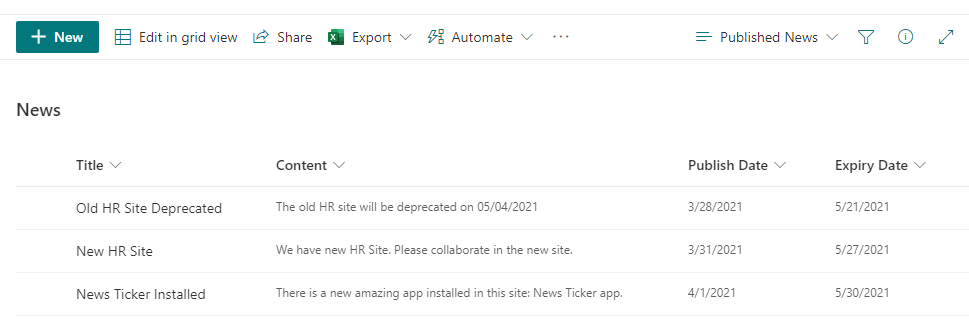
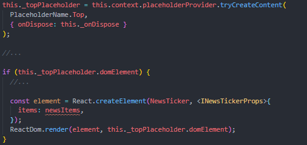
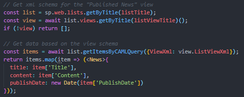
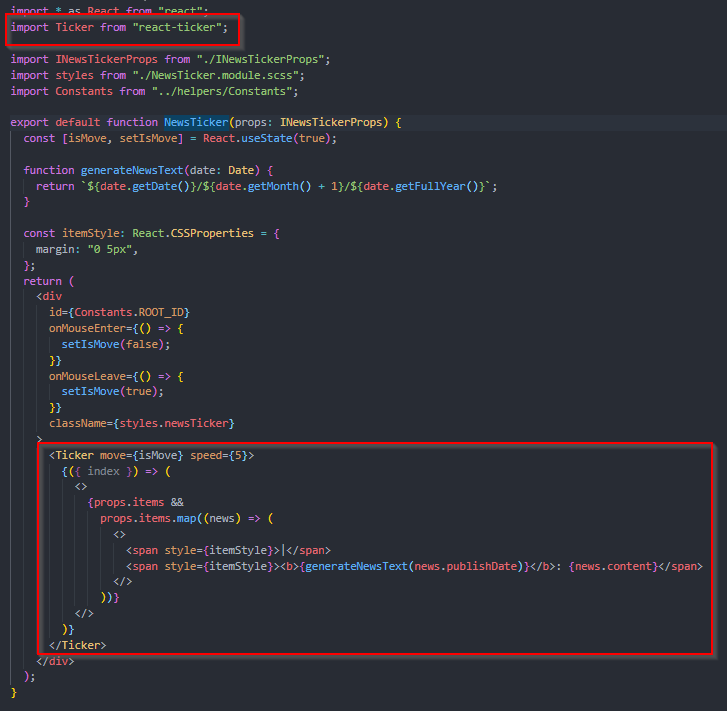

You might be familiar with the running text that shows some breaking
news on a news tv channel. I think it would be nice if we have a similar
thing on a SharePoint site to show some breaking news to its users so I
created the News Ticker app. Basically, the app will show some news from
a SharePoint list as a running text at the top of every modern page on
the site. Below is how it looks:
 

 
Below is the data source:

 
You can find the full source code and how to install
it [react-application-news-ticker](https://github.com/pnp/sp-dev-fx-extensions/tree/main/samples/react-application-news-ticker).
 
In this article, I will share some key points from the solution code
that might be useful for other SPFx projects.
 
### 1. Use React component in the SPFx Extension

SPFx extension doesn't include React component by default but we can
easily add it manually.
We just need to render our React component in the placeholder element
provided by the SPFx Extension Application Customizer.
You can find my implementation
code [NewsTickerApplicationCustomizer](https://github.com/pnp/sp-dev-fx-extensions/blob/635f2cc96302b193ed9fbcfbc8789ffcca229748/samples/react-application-news-ticker/src/extensions/newsTicker/NewsTickerApplicationCustomizer.ts#L87 "GitHub link").
 

 
### 2. Get data from SharePoint list based on View using PnP JS

I'm using SharePoint list as the data source.
In order to make it simple to manage the news, I'm leveraging the list
view and getting the data based on the view configuration.
It's great because we don't need to build any custom configuration
mechanism in our app to configure (sort, filter, top, etc.) the data to
be displayed. Just use the OOTB list view configuration.
It's very easy to get the data based on the list view using the [PnP
JS](https://pnp.github.io/pnpjs/sp/behaviors/). Below is my implementation:

1.  Get the view information
    using [list.views.getByTitle(\...)](https://pnp.github.io/pnpjs/sp/views/#get-views-in-a-list)
2.  Get list item based on the list view XML
    using [list.getItemsByCAMLQuery(\...)](https://pnp.github.io/pnpjs/sp/lists/#get-list-items-using-a-caml-query)
You can find my implementation
code [react-application-news-ticker](https://github.com/pnp/sp-dev-fx-extensions/blob/a2f8ca83d13978835c5a7468c68a2a460bf58a50/samples/react-application-news-ticker/src/extensions/newsTicker/service/SpService.ts#L10).
 

 
### 3. Use React third party component

I'm using an open-source React third party component for the running
text component:
[react-ticker](https://github.com/AndreasFaust/react-ticker).
It's easy to add any React third party components to our SPFx project.
You can find my implementation code
[newsTicker](https://github.com/pnp/sp-dev-fx-extensions/blob/main/samples/react-application-news-ticker/src/extensions/newsTicker/components/NewsTicker.tsx).
 

Thanks for reading. Hope you find this article
useful
