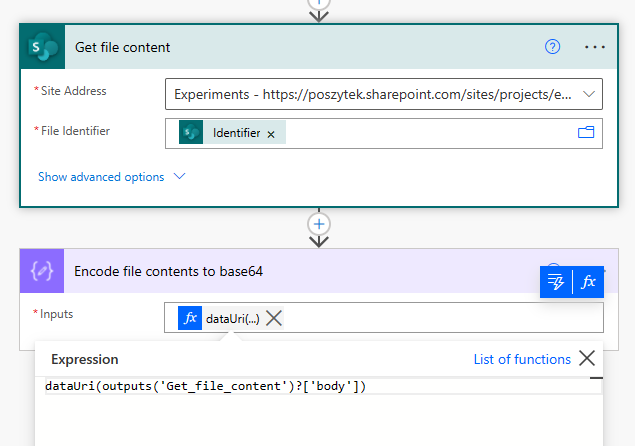
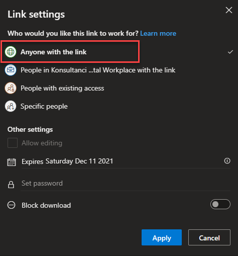
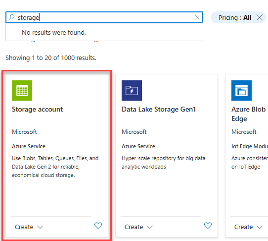
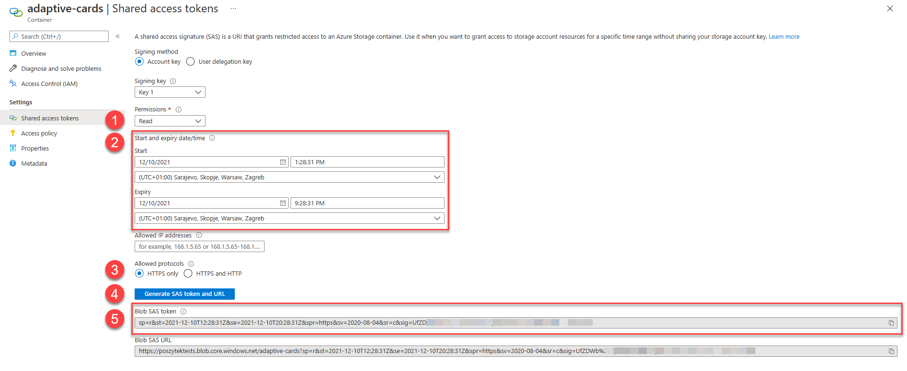

Images always enricher Adaptive Cards designs. However in Microsoft
Teams max. message payload is just 25KB and that includes also the size
of card's JSON. Therefore it is very often not possible to display even
the smallest image inline. What other options we have?
 
## Images in Adaptive Cards 

Basically images are displayed in Adaptive Cards using "Image" element.
In its properties you need to type the URL to an image:
 

 
**Important!** 
Image's URL must start with **https** and be a **direct
link** to a file itself (ending up with jpg, png, tiff, etc...).
 
Ok, so what are the options to display images in Adaptive Cards?
Actually two:

1.  Via an absolute hyperlink to the file itself
2.  Via data uri -- base64 encoded file contents
The first approach I already explained above. It's quite simple. The
second one requires to take file contents and encode them using base64.
This can be done upfront, manually, using online services eg. [Base64
Image Encoder](https://www.base64-image.de/). Or, using
expression `dataUri(file content)` in Power Automate:
 

 
What is returned, looks like the following
string: `data&colon;image/jpeg;base64,/9j/4AAJRgABAQ….QP//Z`. The longer
that string is, the bigger the file is. Finally, that string (or
expression in Power Automate) must be put as a value inside Url property
of the Image element in Adaptive Card design.
 
**Important!** Microsoft Teams message payload can have a size of **max.
25KB **as of today -- that includes the JSON. So if you encode image
into base64 it's easy to realize, that having so many characters will
push the payload to easily exceed that limit. **25KB is 25 000 bytes**,
while one character is encoded **as 1 to 4 bytes**. Just an example, \$
needs one byte, whereas € needs 3 bytes.

## Where to store images? 

Basically, the image that is going to be displayed must be available
anonymously. This is because, Adaptive Card in MS Teams is displayed by
a Teams Bot, not the authenticated user's account, therefore it is not
having the same access permissions as the user who displays the card.
 
Knowing that, it is not possible to store and display images from
SharePoint using absolute path. You can try, by first converting images
to data uri, but remember the payload size :)
 
What other places can be used then?

1.  Anonymous FTP server
2.  Some online image services like [Imgur](https://imgur.com/)
3.  WordPress
4.  Azure Blob Storage
5.  others, allowing to access contents without authentication
OneDrive cannot be used as a storage to host images, since even when we
select to share an image with anyone:
 

 
The generated link is still not a valid, absolute link to a file
itself, but to a page that displays the image, so when you put it as a
Url property, it won't display the
image:
 

 
## How to store images securely, but still display them in Adaptive Cards? 

In such case you need to look for services that allow to secure contents
with connection string/ SAS (shared access signature) that can be added
to absolute URL as url parameters. My favorite is Azure Blob Storage.
Let me show you how.
 
1.  Sign in to Azure portal and create new Storage account:

 
              

1.  Once account is provisioned, open it and:
    1.  Navigate to Containers
    2.  Select to create new container
    3.  Provide its name and set its access to Private
 

 
1.  Now upload image you would like to display in Adaptive Card:
    1.  Select the Upoad link
    2.  Choose a file you want to upload and select all properties as
        per your choice
    3.  Finally after upload navigate to Shared access tokens page
 

 
1.  And finally generate the SAS token, that you can append to the
    absolute image link to make it available for display.
    1.  Define type of permissions -- for this scenario only Read is
        sufficient
    2.  Define expiration dates -- when token will expire and asset will
        become inaccessible again
    3.  Select HTTPS only, since that is what Adaptive Cards support
    4.  Select to Generate SAS token and URL
    5.  Copy the SAS token
 

 
Now you're ready to navigate back to container contents, open file
details, copy its path and append with SAS token:
 

 
Then paste such URL back to Url property of Image element in Adaptive
Card and voilla! There it is:
 

 
I hope you will find this short tutorial useful. Please write down in
comments what other providers you use to securely host images and access
 