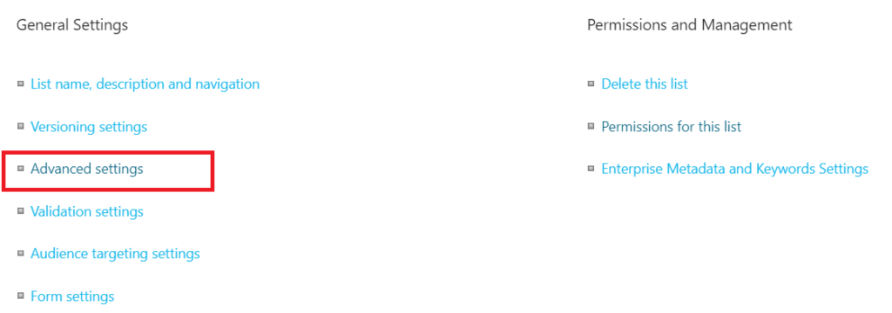
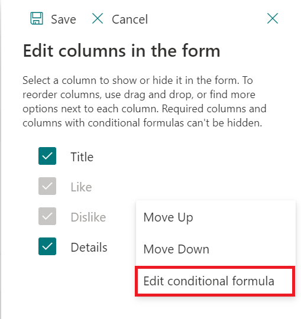
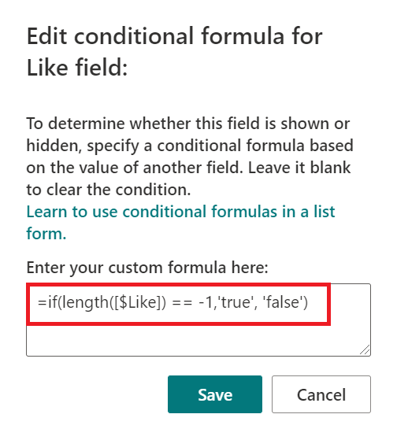

With the **setValue** action on SharePoint/Microsoft Lists JSON formatting, people from the community are creating several solutions or use cases, including myself in the two samples: [Quick Approvals](https://github.com/pnp/List-Formatting/tree/master/column-samples/approval-buttons-setValue-status-user) and [Like/Dislike](https://github.com/pnp/List-Formatting/tree/master/column-samples/multi-person-like-or-dislike-unique-reaction). 

The **setValue** action expands the possibilities of what we can do using list formatting, however, we need to bear in mind that, people are able to easily bypass the rules we implement if they either open the list item from the **list form** or from the **quick edit** view.

With a few tweaks, we can make it more difficult to happen. This post shows the tweaks on the previous Like/Dislike sample, but the idea can be easily reused in other cases.

## 1) Disable Quick Edit (Grid) View

By disabling the Quick Edit in views, people will have to interact with any custom button created or with the list forms to modify data.

To disable Quick Edit, navigate to the list settings page, and under advanced settings:



Disable quick editing:

## 2) Hide the fields from the List form

In any list view, click New:


Under the form customization menu click edit columns:


Instead of removing the fields, click **Edit formula** on the fields you want to hide, and add a condition that is never going to be met:



In the example formula below (relating to the Like/Dislike sample), we are only checking if the users count from the Likes (user multi) field is **equal** to **-1** to display the field.

This condition will never be met, as the likes count is always greater than or equal to zero:



```powerappsfl
    =if(length([$Likes]) == -1,'true', 'false')
```


This trick needs to be done using conditional formulas because, If the fields are hidden by removing them from the form, the values won’t be accessible by the JSON template.

The idea is to have a condition that is never going to be me**t** in the visibility formula, making the field value accessible but always hidden.

**Save** the form changes before continuing.

## 3) Add the custom JSON content to the form header or footer to display the field values

To add a custom header to the previous [Like/Dislike](https://michelcarlo.com/2021/11/28/custom-like-dislike-functionality-using-sharepoint-list-formatting/) sample, the last step is to simply add the custom JSON format to the form header in order to display the values. For this example, the two fields that were hidden in the form will be shown by using the JSON template (as in the earlier formula both Like and Dislike fields were hidden without being removed).

To do it, click on the **‘New item’** option as in the previous step, but now select **‘Configure Layout’**:


And add the JSON template for the Header (or Footer if you prefer to display the values in the Footer):


### JSON Template

```json
    {
        "$schema": "https://developer.microsoft.com/json-schemas/sp/column-formatting.schema.json",
        "elmType": "div",
        "style": {
            "display": "flex",
            "flex-direction": "row"
        },
        "children": [
            {
                "elmType": "div",
                "attributes": {
                    "class": "ms-fontColor-themePrimary"
                },
                "children": [
                    {
                        "elmType": "span",
                        "attributes": {
                            "iconName": "=if(indexOf([$Like.email] , @me) > -1, 'LikeSolid', 'Like')"
                        },
                        "style": {
                            "padding-right": "6px"
                        }
                    },
                    {
                        "elmType": "span",
                        "txtContent": "=length([$Like]) + ' people liked this'",
                        "style": {
                            "padding-right": "12px"
                        }
                    }
                ]
            },
            {
                "elmType": "div",
                "attributes": {
                    "class": "ms-fontColor-themePrimary"
                },
                "children": [
                    {
                        "elmType": "span",
                        "attributes": {
                            "iconName": "=if(indexOf([$Dislike.email] , @me) > -1, 'DislikeSolid', 'Dislike')"
                        },
                        "style": {
                            "padding-right": "6px"
                        }
                    },
                    {
                        "elmType": "span",
                        "txtContent": "=length([$Dislike])+ ' people disliked this'"
                    }
                ]
            }
        ]
    }
```
**Save** the form changes, and now the list form will now look like this, with the read-only values displayed in the header:

## Conclusion

This trick makes it harder for people to edit the values in the form, however, it does not lock the fields fully. Be aware that people can use SharePoint APIs, Power Automate or Power Apps to bypass the read-only values if they have collaboration permissions in the lists or libraries.

## Additional References

Conditional formulas for form fields reference: [Show or hide columns in a list or library form](https://docs.microsoft.com/en-us/sharepoint/dev/declarative-customization/list-form-conditional-show-hide)


