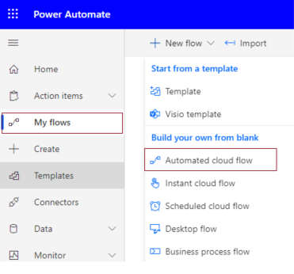
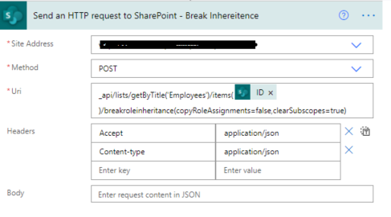
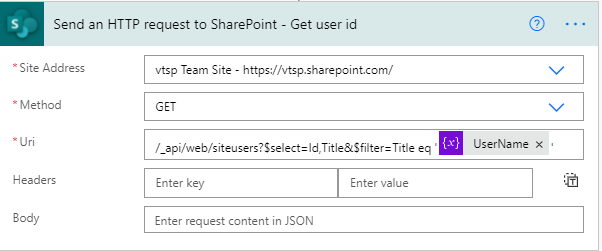
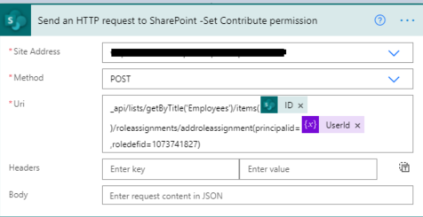

## Introduction

In this article, we will see a step-by-step implementation of how to
break and change list item permission using Power Automate. and for
this, we will use REST API

## Implementation 

Create a SharePoint List

Create a Power Automate - We will create an **Automated Cloud Flow**

1.  Go to **Power Automate** \> **My flows** \> Select  **New flow** \>
Select **Automated Cloud Flow**
**
 
2.  It will ask for the flow name and trigger.
Add flow name and choose a trigger **when an item is created.**

3.  Select  **Cerate.**
4.  Now set Site name and list name in **when an item is created in
list **action.

**For all API Calling, we will use Send an HTTP request to SharePoint
action.**
5.  Now we will call REST API to break role inheritance.

Set all properties as below.
  ----------------------------------- ---------------------------------------------------------------------------------------------------------------------
  **Site Address**                    Select Site Name from Dropdown

  **Method**                          POST

  **Uri**                             \_api/lists/getByTitle('ListTitle')/items(ID)/breakroleinheritance(copyRoleAssignments=false,clearSubscopes=true)

  **Headers**                         {\
                                      "Accept": "application/json",\
                                      "Content-type": "application/json"\
                                      }
  ----------------------------------- ---------------------------------------------------------------------------------------------------------------------
 


 

1.  Now we will set new permission so for that we need a **user id** to
whom we have to give permission and need a **role definition ID**.
**User ID: **You can directly use User ID if you have or if you have a
user name or login name then we have to find user id from the particular
user so for that we will call REST API.
**Role definition ID:** You can use id based on permission.

  -------------------------- ------------------------
  **Role Definition Name**   **Role Definition Id**
  Limited Access             1073741825
  View Only                  1073741924
  Design                     1073741828
  Edit                       1073741830
  Contribute                 1073741827
  Read                       1073741826
  Full Control               1073741829
  -------------------------- ------------------------

Create a variable and set User Title or if you have any list column
then you can use it.


Call API to get a user ID and filter it by the above-declared user
name.



It will return an object as below,
 

```json
{
  "d": {
    "results": [
      {
        "__metadata": {
          "id": "https://sitename.sharepoint.com/_api/Web/GetUserById(2)",
          "uri": "https://sitename.sharepoint.com/_api/Web/GetUserById(2)",
          "type": "SP.User"
        },
        "Id": 2,
        "Title": "Chandani Prajapati"
      }
    ]
  }
}
```
 

Now we want to use the only id from this so we will use an expression as
below,

``` lia-indent-padding-left-30px
outputs('Send_an_HTTP_request_to_SharePoint_-_Get_user_id')?['body']['d']['results']?[0]['Id']
```

And we will set it in a variable called **UserId**.


Now we will set **contribute** permission for the above UserId.


 

Now we can test the flow.
 
## Output

We can see contribute permission for an item as below,

-align-center image-alt="OP.png" style="width: 999px;"}
 

## Summary 

In this article, we have seen how to break and change list item
permission using power automate.
Hope this helps!
Sharing is caring!
