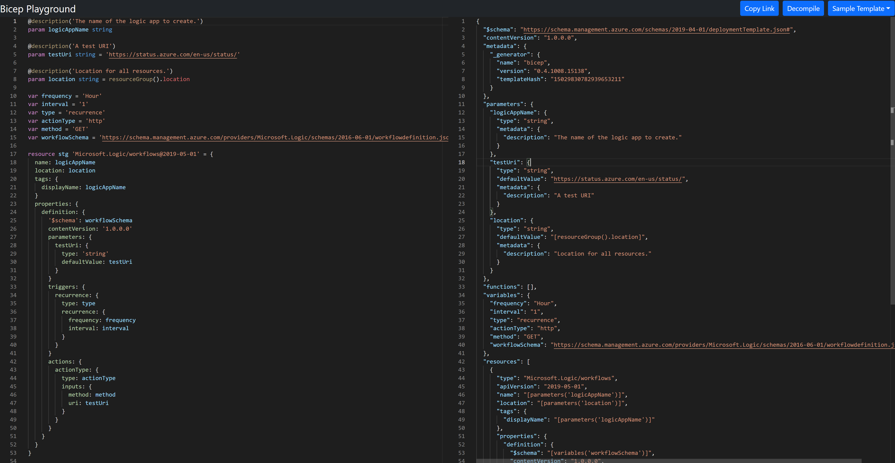

## tl;dr - why would I care?

> Bicep is an awesome language to deploy Azure resources using a simple syntax but with some awesome features like for-loops, modules and being able to share deployment files in your organization.

## What is Bicep?

Good question. First of all, it's most probably Azure's nerdiest dad joke, as it derives from ARM (Azure Resource Manager) and has something to do with the biceps doing the heavy lifting/provides extra power 💪.

Bicep is a language specific to Azure and is used to provide Infrastructure-as-Code in an easy-to-author way. Syntax is much simpler than regular ARM templates and this results in more readable files.

This sample shows how to deploy Azure Cognitive services.

```Bicep
param serviceName string = 'cognitive-${uniqueString(resourceGroup().id)}'
param location string = resourceGroup().location
param sku string = 'S0'

resource cognitiveService 'Microsoft.CognitiveServices/accounts@2017-04-18' = {
  name: serviceName
  location: location
  sku: {
    name: sku
  }
  kind: 'CognitiveServices'
}
```

If you compare this to the JSON definition, you will notice

- less curly brackets
- less quotation marks
- less lines of code

```JSON
{
  "$schema": "https://schema.management.azure.com/schemas/2019-04-01/deploymentTemplate.json#",
  "contentVersion": "1.0.0.0",
  "metadata": {
    "_generator": {
      "name": "bicep",
      "version": "0.4.1008.15138",
      "templateHash": "3830258995596078"
    }
  },
  "parameters": {
    "serviceName": {
      "type": "string",
      "defaultValue": "[format('cognitive-{0}', uniqueString(resourceGroup().id))]"
    },
    "location": {
      "type": "string",
      "defaultValue": "[resourceGroup().location]"
    },
    "sku": {
      "type": "string",
      "defaultValue": "S0"
    }
  },
  "functions": [],
  "resources": [
    {
      "type": "Microsoft.CognitiveServices/accounts",
      "apiVersion": "2017-04-18",
      "name": "[parameters('serviceName')]",
      "location": "[parameters('location')]",
      "sku": {
        "name": "[parameters('sku')]"
      },
      "kind": "CognitiveServices"
    }
  ]
}
```

Time to play! If you like to familiarize yourself with Bicep, you can use the [Bicep Playground](https://bicepdemo.z22.web.core.windows.net/) - it's an interactive experience that lets you explore and try out Bicep - similar to [MGT Playground](https://mgt.dev/), [Graph Explorer](https://developer.microsoft.com/graph/graph-explorer) or [Adaptive Cards Designer](https://adaptivecards.io/designer/) in a safe space where you can't break anything. (I took the example from that Playground)



## How do you create a Bicep template from an Azure resource?

In order to create a deployable Bicep file, we will need to use some tools. I will work on Windows and with Azure CLI, but you can of course choose Azure PowerShell as well or work on Linux or Mac.

### Tools

- In [Visual Studio Code](https://code.visualstudio.com/) (VS Code), install the [Bicep extension](https://marketplace.visualstudio.com/items?itemName=ms-azuretools.vscode-bicep). (Most probably you will need to restart VS Code after installing the extension.)
- Install [Azure CLI](https://docs.microsoft.com/cli/azure/install-azure-cli-windows?tabs=azure-cli) - You can validate which version you have installed when you run `az --version` in your terminal.
- Install **Bicep CLI** in terminal by running `az bicep install`. If you did that already a while ago, it's a good idea to upgrade to the latest version with `az bicep upgrade`

### Get the ARM template

You *could* of course write the entire definition of your resources from scratch (and with the extension installed you get Intellisense, which is really convenient), but as you probably already built resources, you can go to the Azure portal and export the ARM template:

1. Open the [Azure portal](https://portal.azure.com)
2. Select the resource group
3. If you want to export a template for the entire resource group including all resources
   - select **Export template**
4. If you want to export only the template for a particular resource
   - select the resource
   - select **Export template**
5. Extract the downloaded `.zip` file
6. Open the extracted `template.json` file in VS Code

### Decompile

1. Open the terminal
2. Navigate to the folder where your template.json file sits
3. Run `az bicep decompile --file template.json`

This will create a new file `template.bicep`. To make this template file better, we will do a few things:

### Modules

If you want to deploy more than one resource, you will end up with a very lengthy file, which makes it hard to gain overview - also collaboration and debugging is hard with that. Luckily, Bicep knows a concept that is called modules, which are also Bicep files that can be deployed from a root Bicep file. You can even [share modules](https://docs.microsoft.com/azure/azure-resource-manager/bicep/private-module-registry?tabs=azure-powershell) for reusing modules in your organization.

This is how we do it:

1. Select the resource in the template.bicep file
2. Cut it and paste it into a new Bicep file (e.g. `My-managedIdentity.bicep`)
3. Repeat this with the other resources as well
4. Now create modules in `template.bicep` like this:

```Bicep
module managedIdentityDeployment 'My-managedIdentity.bicep' = {
  name: 'managedIdentityDeployment'
  params: {
    userAssignedIdentities_My_Identity_name: userAssignedIdentities_My_Identity_name
    resourceLocation: resourceLocation
  }
}
```

Make sure that you declare the parameters in the file as well. Repeat this until have a module for each resource that is defined in a corresponding Bicep file.

### Few tweaks and quirks

If - in your exported template you had hard coded values that you still want to get rid of - this is a good time to do that:

```Bicep
resource workflows_MyWorkflow_name_resource 'Microsoft.Logic/workflows@2017-07-01' = {
  name: workflows_MyWorkflow_name
  location: 'westeurope'
  identity: {
    type: 'UserAssigned'
    userAssignedIdentities: {
      '/subscriptions/fdf0XXX-0726-404c-XXX-23d183XXX/resourceGroups/MyResourceGroup/providers/Microsoft.ManagedIdentity/userAssignedIdentities/My-ManagedIdentity': {}
    }
  }
}
```

We would replace the hard coded value of the userAssignedIdentities that contains our Subscription Id with

```Bicep
{
      '${resourceId('Microsoft.ManagedIdentity/userAssignedIdentities/',userAssignedIdentities_My_Identity_name)}': {}
}
```

Also, we would replace the hard coded value `'westeurope'` with a parameter.

Sometimes when decompiling, we don't get the right API version - in this case we got `2017-07-01` - but in fact `2019-05-01` is correct. How would we know? Bicep extension warns us with yellow squiggly lines :-)


### Deploy with Azure CLI

Now let's deploy this to Azure! Again, we will be using Azure CLI

```Bicep
$DeployTimestamp = (Get-Date).ToUniversalTime().ToString("yyyyMMdTHmZ")
az deployment group create `
    --name "DeployLinkedTemplate-$DeployTimestamp" `
    --resource-group $ResourceGroupName `
    --template-file path-to/template.bicep `
    --verbose
```

That's it 🚀

## What do you think?

[Let me know on twitter](https://twitter.com/LuiseFreese/status/1501632661084950532) on log in to GitHub and comment below!
