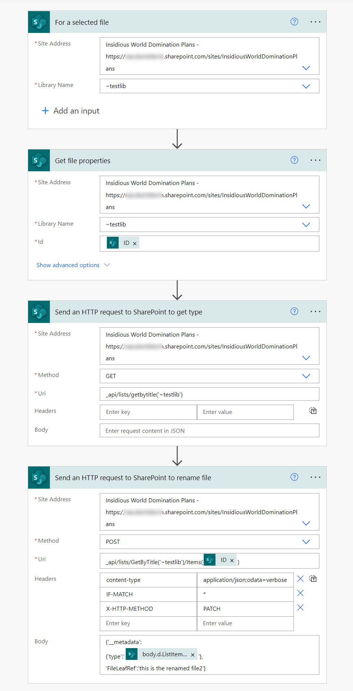

## the issue

Although SharePoint and Power Automate are heavily interwoven, there is no "rename file" action in Power Automate - if the file lives in a SharePoint library. Out of the box that is only possible for files living in OneDrive.

I recently saw a cry for help on [twitter](https://twitter.com/_achu/status/1518786319907901442?s=20&t=XHVS1oXjKIC_cksmztVWDg) and decided to share here how my solution looks like.

In order to change a filename, we will need to use SharePoint REST API, which is accessible to us in Power Automate via the **Send an HTTP request to SharePoint** action.

## the Power Automate flow



1. To make things easy, we start with a **For selected file** trigger. (In a real-world scenario, you'd typically rename a file after something else has happened.)
2. We then **Get file properties** (not needed as we already have the `ID` from the **For selected file** trigger, but if yo9u run this after another action you will need the file properties to get the `Id` so that you can rename the right file).
3. We now need to use the **Send an HTTP request to SharePoint** action:
   *  Site Adress: choose from Dropdown
   *  Method: `Get`
   * Uri: `_api/lists/getbytitle('<DisplayName of your Library goes here>')`

   This will re turn the `ListItemEntityTypeFullName` property, which we will need for the next step.
4. As a last step, use another **Send an HTTP request to SharePoint** action:
   * Site Adress: choose from Dropdown
   * Method: `Post`
   * Uri: `_api/lists/GetByTitle('<DisplayName of your Library goes here>')/Items(@{outputs('Get_file_properties')?['body/ID']})`
   * Headers:
      * **Content-type**: `application/json`
      * **IF-MATCH**: `*`
      * **X-HTTP-METHOD**: `PATCH`
   * Body:

```JSON
{'__metadata':
{'type':'@{outputs('Send_an_HTTP_request_to_SharePoint_to_get_type')?['body']?['d']?['ListItemEntityTypeFullName']}'},
'FileLeafRef':'<your new filename goes here>'}
```

> 💡 For the type, we are selecting the `ListItemEntityTypeFullName` property from the output of the previous action. You could also use **Parse JSON** action to obtain that value.

## Conclusion

Once again, the **Send an HTTP request to SharePoint** action in Power Automate is a lifesaver for everything that doesn't work with the built-in actions. Also, no additional license than your Microsoft 365 license is required to use it.

## Resources

To learn more about SharePoint REST, use these resources:

* [Get to know the SharePoint REST service](https://docs.microsoft.com/sharepoint/dev/sp-add-ins/get-to-know-the-sharepoint-rest-service?tabs=csom)
* [Working with lists and list items with REST](https://docs.microsoft.com/sharepoint/dev/sp-add-ins/working-with-lists-and-list-items-with-rest)

*first published on [m365princess.com](https://m365princess.com)*
