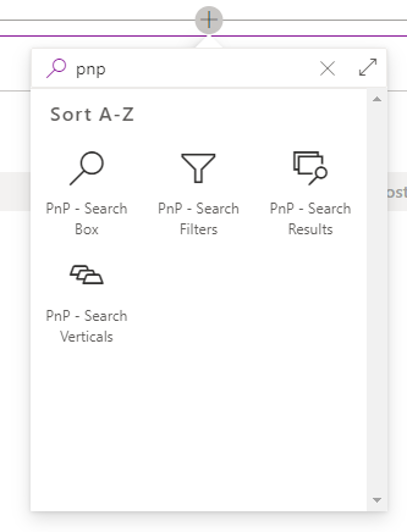
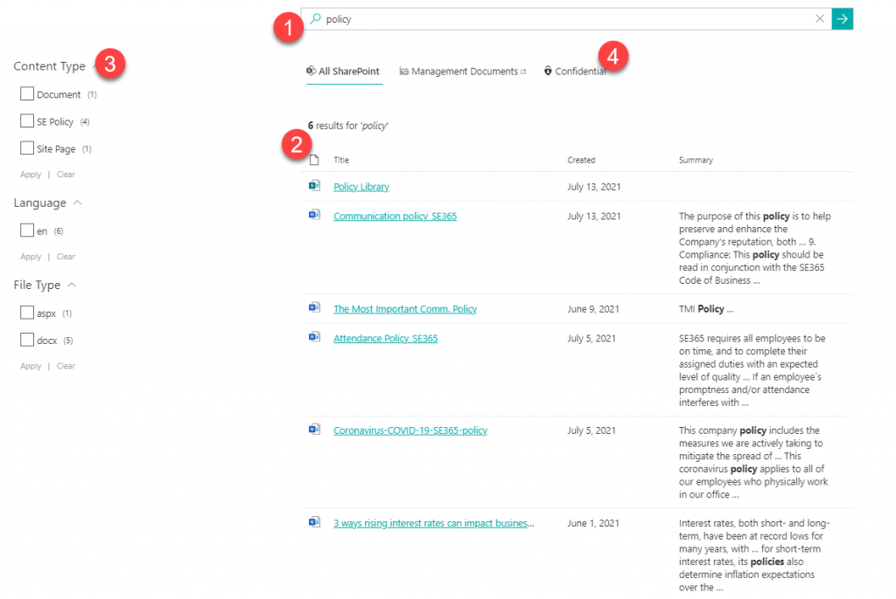
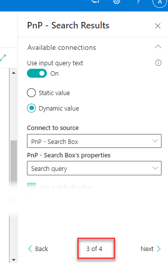
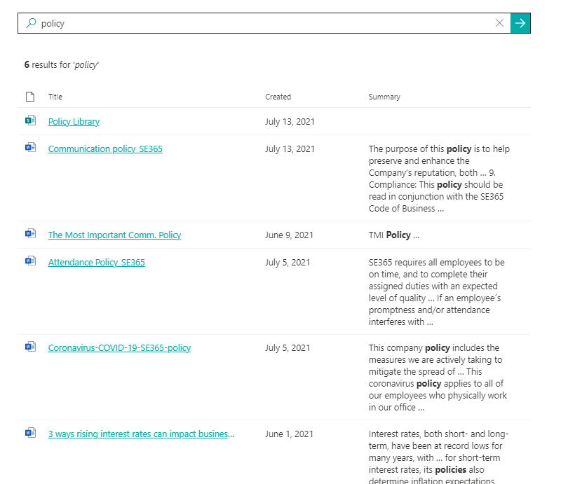

After [deploying PnP Modern Search to your
tenant](https://searchexplained.com/deploy-pnp-modern-search-web-parts-sharepoint-online/),
it's time to create the first PnP search page.
> PnP search pages can be added to any modern site, so it's your
> decision where to do this. My recommendation is always try this out on
> a "playground" site first, before deploying to production.

## 1 -- Create an empty page 

The first step is to create an empty page, where you'll add the PnP web
parts. Go to any of your modern sites, and create a new page:

 

## 2 -- Add the PnP web parts 

The next step is to add the PnP web parts to your page. The package,
that you've deployed, adds the following web parts available on your
modern pages:

You can get to these web parts when search for "PnP" or "search" in the
web part gallery:

1.  PnP Search Box
2.  PnP Search Results
3.  PnP Search Filters
4.  PnP Search Verticals

On a very simple search page, we have at least two web parts: a search
box and a search results web part.

### Search Box Web Part 

You simply add a Search Box to the page by choosing "PnP Search Box" web
part. At this point, you don't have to do any further configuration.

### Search Results Web Part 

The next step is to add a "PnP Search Results" web part to the page.

Once the web part is added to the page, you have to connect it to the
Search Box web part, to receive the query from there. You can do this by
following these steps:

1.  Edit the page.
2.  Edit the properties of the Search Results web part.
3.  Switch to page "3 of 4" on the web part properties.
4.  Turn on "Use input query text".
5.  Select "Dynamic value" in the radio button list.
6.  Select "PnP -- Search Box" in the "Connect to source" dropdown.
7.  Select "Search query" in the "PnP -- Search Box's properties"
    dropdown.

Once done, save the page and enjoy your very first search page!

*This article was originally posted on [Search Explained
Blog](https://searchexplained.com/deploy-pnp-modern-search-web-parts-sharepoint-online/).*
