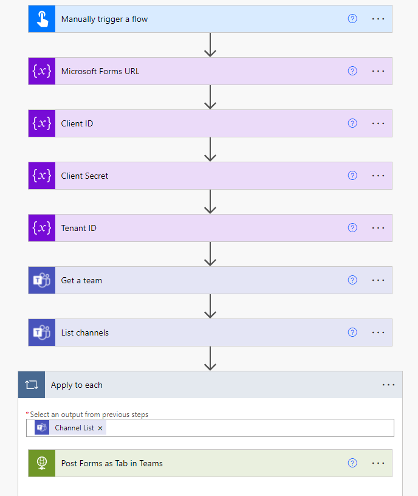
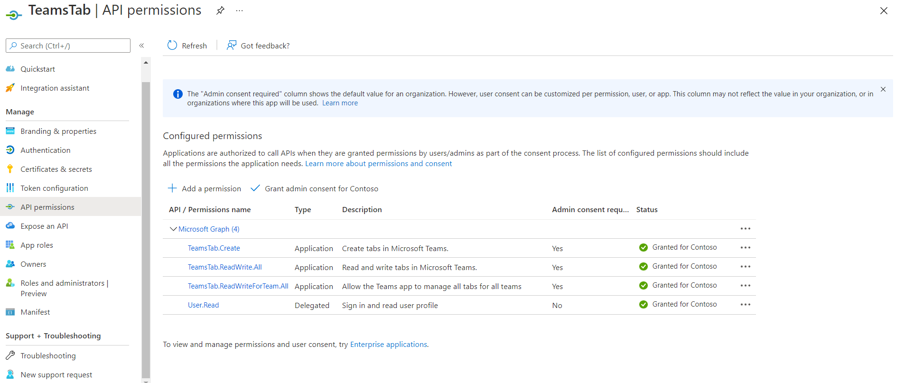
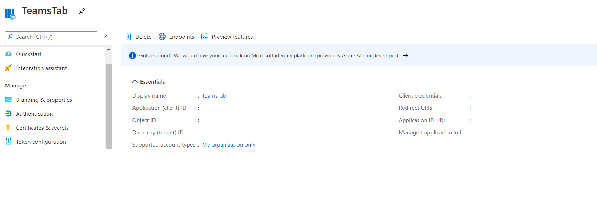
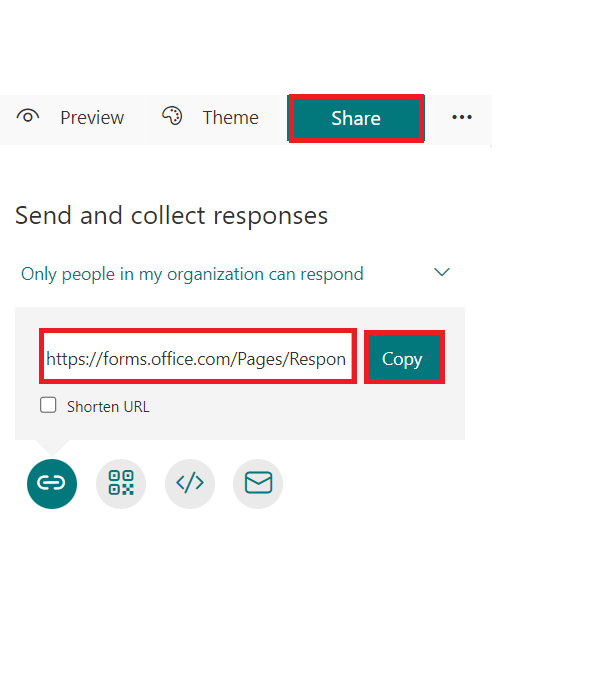
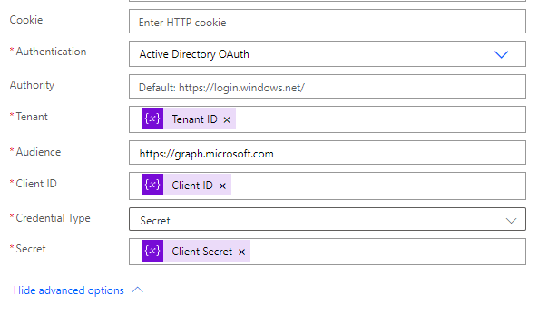
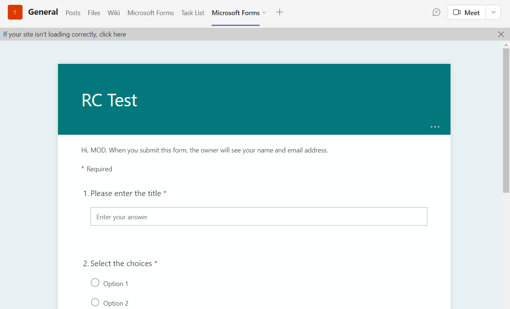

This article is focused on how you can add Forms as a Website Tab in Microsoft Teams using [Post Tab in Teams channel graph API](https://docs.microsoft.com/en-us/graph/api/channel-post-tabs?view=graph-rest-1.0)

From the below shown figure 1.1 You can see the whole layout of the Power Automate flow which when triggered will add Form into Teams channel as a Tab



Fig 1.1 – Post Forms as Tab in Microsoft Teams Power Automate Flow diagram

Before digging more into Power Automate, Create an Azure AD App by giving the Application permissions required for [Add Tabs to Channel API](https://docs.microsoft.com/en-us/graph/api/channel-post-tabs?view=graph-rest-1.0) just like shown in Fig 1.2



Fig 1.2 – Azure AD App with Application Permissions for Adding Tabs to Channel graph API

Navigate to your Resource Group as shown in Fig 1.3, and copy the Client ID, Tenant ID, Create the Client Secret and copy the Client Secret Value and save all these values in a notepad as this will be used in the later steps



Fig 1.3 – Azure AD App Details

Note: Create a Microsoft Form in your tenant and Save the Form Link, you can get the Form link by clicking on the Share Button and copying the link. Save the link in the notepad as it will be used in the Power Automate Flow. Look into the Fig 1.4 to know on how you can get Forms Link



Fig 1.4 – Microsoft Forms URL

Now it’s the time to dig into creating Power Automate Flow which when triggered will add Forms a Tab to your Teams Channel

Step 1: Create a manual trigger flow

Step 2: Look into the Fig 1.5, Select Initialize Variable, give a name as FormsURL and give the value as Forms Link which you saved in the notepad as mentioned above from Fig 1.4. Select the type as string


Fig 1.5 – Initialize variable to save Forms URL

Step 3: Look into Fig 1.6, Select Initialize Variable, give a name as Client ID and give the value of Azure AD App Client ID which we saved in the notepad. Select the type of variable as String


Fig 1.6: Initialize Client ID string type variable to store Azure AD App Client ID value

Step 4: Look into Fig 1.7, Select Initialize Variable, give a name as Client Secret and give the value of Azure AD App Client Secret which we saved in the notepad. Select the type of variable as String


Fig 1.7: Initialize Client Secret string type variable to store Azure AD App Client Secret value

Step 5: Look into Fig 1.8, Select Initialize Variable, give a name as Tenant ID and give the value of Azure AD App Tenant ID which we saved in the notepad. Select the type of variable as String


Fig 1.8: Initialize Tenant ID string type variable to store Azure AD App Tenant ID value

Step 6: Now we will get the Team and Channel where we want to add Forms Tab, Select Get Teams connector and give the Team Name like shown in Fig 1.9


Fig 1.9 – Get Team and enter the value of the Team Name

Now select, List Channels connector and give the team’s name, this will list all the channels in the given Team.

Voila, It’s the time to use the graph API (Post Tab in Channels) in the HTTP Action.

Step 7: Graph API – POST Request

Request URL: `https://graph.microsoft.com/v1.0/teams/{id}/channels/{id}/tabs`

In the request URL : `TeamsID`  - select dynamically Team ID from the Get Team , For Channel ID – select dynamically Channel ID from List Channels

Request Body: 

```json
{

  "displayName": "Microsoft Forms",

  "teamsApp@odata.bind": "[https://graph.microsoft.com/beta/appCatalogs/teamsApps/com.microsoft.teamspace.tab.web](https://graph.microsoft.com/beta/appCatalogs/teamsApps/com.microsoft.teamspace.tab.web)",

  "configuration": {

    "entityId": "2DCA2E6C7A10415CAF6B8AB6661B3154",

    "contentUrl": "@{variables('FormsURL')}",

    "websiteUrl": "@{variables('FormsURL')}",

    "removeUrl": ""

  },

  "teamsAppId": "81fef3a6-72aa-4648-a763-de824aeafb7d "

}
```

For, Content URL and Website URL in the HTTP Request Body, select dynamically the Forms URL variable which we declared at the top of the Flow

Teams APP ID for Website tab will be:

To know more on Teams APP ID refer; [Configuring built-In Tab types in Teams](https://docs.microsoft.com/en-us/graph/teams-configuring-builtin-tabs#:~:text=For%20document%20library%20tabs%2C%20the,tab.)

In this use-case, For Microsoft Forms the teamsAppID is: `81fef3a6-72aa-4648-a763-de824aeafb7d`

Look into Fig 1.10 which shows the Post Request with the Request body and URL


Fig 1.10- Post Tabs in Teams HTTP Request

 Now it’s the time to authenticate your given API as shown in Fig 1.11, In the same HTTP Request action, scroll down and select Active Directory OAuth and give the Tenant ID, Client ID, Client Secret variables as value for authentication



Fig 1.11 – Authenticate graph API using Azure AD OAuth

The Power Automate flow is now ready to test. Click on Test and select Manually as we have added Manual trigger for the flow to run. Once the Flow runs you will see Microsoft Forms added to your Teams General Channel as Tab, like shown in Fig 1.12



Fig 1.12 – Microsoft Forms added as Tab in Teams Channel using Graph API in Power Automate

I hope this article helps you in understanding how you can leverage graph API In HTTP request in Power Automate

Stay tuned for my upcoming blogs.

Keep Reading, Keep Sharing!
