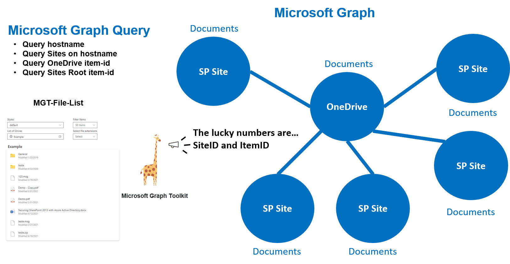
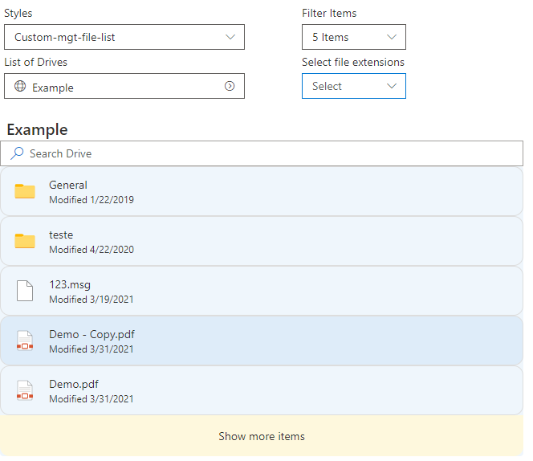
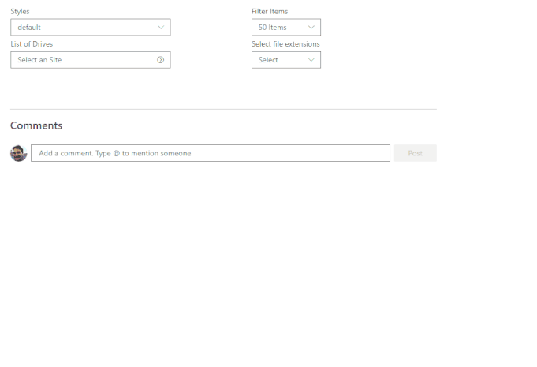

In my process of self learning regarding different technologies such us
Azure, SPFX WebPart, React, Microsoft Graph, Node.js, Teams and all
other Office 365 services, was surprise to find the current work already
made by "[Microsoft Graph
Toolkit](https://github.com/microsoftgraph/microsoft-graph-toolkit/)"
and associated documentation on how to implemented with Microsoft Graph.

The amount of content and features already develop to integrate multiple
platforms are definitely the Key to communicate with Office 365 and
became easy to access content without a lot of effort, congrats to all
the team.
This sample use SharePoint Online SPFX WebPart with **Mgt-File-List and
Mgt-File Beta version** control to retrieve Shared Libraries as
**existing in OneDrive**, navigate between their folders and use filter
by file extension in a simple way using Microsoft Graph API Drive and
Site.
Below a draw resuming the custom query's made and what control uses to
retrieve associated folders and files from different locations.



### How the Mgt-File-List Work 

As OneDrive, this control allow to display Shared Files and Folders, for
this **ItemID (identity of the item to read, can be a folder or a
file)** has the main role on how to access content. To facilitate this
access the control has multiple properties that allows call to content
using different options such us: **custom query's*

This sample used the parameters **SiteID** (SharePoint Online Site ID)
and **ItemID** it's the ID of the root Library used on site to store
documents and control to display files/folders from that Path and
navigate between them.

Solution also uses the property **File-List-Query** that allows to
search files inside shared Libraries.

``` {.lia-code-sample .language-html}
<FileList
        siteId={this._siteID}
        itemId={this._itemID}
></FileList>
```

#### Where can I found SiteID of a site? 

Use the **Site Graph API with search** query based on hostname to
retrieve ID's of sites.

``` {.lia-code-sample .language-html}
"https://graph.microsoft.com/v1.0/sites?search=*****.sharepoint&$Select=id"
```

List of Site ID's:

```json
{
    "@odata.context": "https://graph.microsoft.com/v1.0/$metadata#sites(id)",
    "value": [
        {
            "id": "*******.sharepoint.com,000000-0000-0000-0000-000000,000000-0000-0000-0000-000000"
        },
        {
            "id": "*******.sharepoint.com,000000-0000-0000-0000-000001,000000-0000-0000-0000-000001"
        },
...
```

#### How can I found the Root Folder ItemID from Site?

This can be achieved using the **SiteID** from last query and call the
drive root from Site.

``` {.lia-code-sample .language-html}
https://graph.microsoft.com/v1.0/sites/*****.sharepoint.com,000000-0000-0000-0000-000000,000000-0000-0000-0000-000000/drive/Root?$select=id
```

This query returns the **Item-id** of the root Folder that can be used
to display content in Control.

``` {.lia-code-sample .language-html}
"id": "01CM5BY6********************************"
```


#### Retrieve OneDrive Root Folder Item-id

OneDrive is managed differently and there is no need of SiteID just make
the following Drive call.

``` {.lia-code-sample .language-html}
https://graph.microsoft.com/v1.0/me/drive/root/?$Select=id
```

PS: This query's can be tested using the following site.

<https://developer.microsoft.com/graph/graph-explorer>

Below some additional Mgt-File-List documentation regarding possible
options to use.

-   [FileList
    specifications](https://github.com/microsoftgraph/microsoft-graph-toolkit/blob/main/specs/mgt-file-list.md)
-   [FileList
    Stories](https://github.com/microsoftgraph/microsoft-graph-toolkit/blob/main/stories/components/fileList.stories.js)

This main query will allow to fully explore the **Mgt-File-List**
features that were used in sample
"[react-oneDrive-finder](https://github.com/pnp/sp-dev-fx-webparts/tree/master/samples/react-onedrive-finder)"

-   List of Drives Sites
-   Content List and Breadcrumb
-   Filter of Items
-   Filter by file extension
-   Custom Theme styles 



### Mgt provider and SharePointProvider 

It's important that permissions are given from Microsoft Graph to SPFX
WebPart that Mgt-File-List could make the necessary query's.

Access to config/package-solution.json and ensure the following
permissions are given on SharePoint package.

```json
    "webApiPermissionRequests": [{  
      "resource": "Microsoft Graph",  
      "scope": "Files.Read"  
  }, {  
      "resource": "Microsoft Graph",  
      "scope": "Files.Read.All"  
  }, {  
      "resource": "Microsoft Graph",  
      "scope": "Sites.Read.All"  
  }] 
```

Access to your code into **BaseClientSideWebPart** area and ensure
SharePoint Provider is loaded with the current security  access
that Mgt-File-List control and custom graph query's could access to
Microsoft Graph content.

```javascript
import { Providers, SharePointProvider } from '@microsoft/mgt';
...
export default class OneDriveFinderWebPart extends BaseClientSideWebPart<IOneDriveFinderWebPartProps> {
  protected onInit() {
    Providers.globalProvider = new SharePointProvider(this.context);
    return super.onInit();
  }
...
```

After defining the provider you should be able to include control and
use parameter's id without permissions errors.

``` {.lia-code-sample .language-html}
import { FileList } from '@microsoft/mgt-react';
...
<FileList
              siteId={this._siteID}
              itemId={this._itemID}
              itemClick={this.manageFolder}
            ></FileList>
```

### Breadcrumb Navigation

It's also possible to use Breadcrumb to include the path of folders
where user is situated in the Library.

This can be achieve capturing the **itemID** of Folder listed
in **Mgt-File-List,** using the event `itemClick={(e)=>{
console.log(e.details);}`

More information can be found on Mgt-File-List
[documentation](https://github.com/microsoftgraph/microsoft-graph-toolkit/blob/main/stories/components/fileList.stories.js)
or by sample
"[react-onedrive-finder](https://github.com/pnp/sp-dev-fx-webparts/tree/master/samples/react-onedrive-finder)".

### Filtering file extensions 

The Mgt-File-List property **fileExtensions** allows to filter documents
by file extension, this can be very handy when dealing with large
amounts of documents.

Code below shows how can be implemented a multiple file extensions
filter.

``` {.lia-code-sample .language-html}
 const checkFileExtensions = (event: React.FormEvent<HTMLDivElement>, selectedOption: IDropdownOption) => {
      let fileExtensions: string[] = [];
      if (selectedOption.selected == true) {
        fileExtensions.push(selectedOption.key.toString());
        fileExtensions = [...fileExtensions,...this.state.fileExtensions];
      } else {
        fileExtensions = this.state.fileExtensions.filter(e => e !== selectedOption.key );
      }
      this.setState({
        fileExtensions: [...fileExtensions]
      });
    };
.....
<Dropdown
    placeholder="Select"
    label="Select file extensions"
    multiSelect
    options={[
          { key: "", text: 'folder' },
          { key: "docx", text: 'docx' },
          { key: "xlsx", text: 'xlsx' },
          { key: "pptx", text: "pptx" },
          { key: "one", text: "one" },
          { key: "pdf", text: "pdf" },
          { key: "txt", text: "txt" },
          { key: "jpg", text: "jpg" },
          { key: "gif", text: "gif" },
          { key: "png", text: "png" },
        ]}
    onChange={checkFileExtensions}
    styles={dropdownFilterStyles}
/>
...
<FileList
    fileExtensions={this._fileExtensions}
    ...
/></FileList/>
```

### Styling with Mgt-File-List

The Mgt-File-List includes Light and Dark theme but you can also provide
your custom styles.

``` {.lia-code-sample .language-html}
<FileList
    className="mgt-dark"
    ...
></FileList>
```

To create your own custom style look and feel you can use css elements
to customize Mgt-File-List.

Below some of the options available and shared in [FileList
Stories](https://github.com/microsoftgraph/microsoft-graph-toolkit/blob/main/stories/components/fileList.stories.js)
of the Beta Version.

``` {.lia-code-sample .language-css}
.mgtfilelist {
  --file-list-background-color: #eff6fc;
  --file-item-background-color--hover: #deecf9;
  --file-item-background-color--active: #c7e0f4;
  --file-list-border: 0px solid #white;
  --file-list-box-shadow: none;
  --file-list-padding: 0px;
  --file-list-margin: 0;
  --file-item-border-radius: 0px;
  --file-item-margin: 0px 0px;
  --file-item-border-top: 1px solid #dddddd;
  --file-item-border-left: 1px solid #dddddd;
  --file-item-border-right: 1px solid #dddddd;
  --file-item-border-bottom: 1px solid #dddddd;
  --show-more-button-background-color: #fef8dd;
  --show-more-button-background-color--hover: #ffe7c7;
  --show-more-button-font-size: 14px;
  --show-more-button-padding: 16px;
  --show-more-button-border-bottom-right-radius: 12px;
  --show-more-button-border-bottom-left-radius: 12px;
}
```

### Search in Shared Libraries

The control by the property **"fileListQuery"** also allow the usage
Graph Drive Search method to find Items in the Drive. Below an sample on
how you could use a dynamic to search items in Drives.

``` {.lia-code-sample .language-html}
//Make query on Shared Library or OneDrive Library 
const checkSearchDrive = (SearchQuery: string) => {
      if (this.state.siteID != "") {
        this.setState({
          searchDrive: "/sites/" + this.state.siteID + "/drive/root/search(q='" + SearchQuery + "')"
        });
      } else {
        this.setState({
          searchDrive: "/me/drive/root/search(q='" + SearchQuery + "')"
        });
      }
    };
    
//Search Box for Shared Library 
<SearchBox placeholder="Search Drive" onSearch={checkSearchDrive} onClear={checkClear} />

//Display search content
{(this.state.searchDrive != "") &&
    <FileList
    fileListQuery={searchDrive}
    ></FileList>
}
```

### Final sample solution 

Below the final result of the configuration of **Mgt-File-List** react
controls:



Solution can be found in the *SharePoint Framework Client-Side Web Part
Samples* - **OneDrive finder**:

<https://github.com/pnp/sp-dev-fx-webparts/tree/master/samples/react-onedrive-finder>

*PS: Solution will be updated with release version
when **Mgt-File-List** is available by the Microsoft Graph Toolkit.*

### How to start with Microsoft Graph Toolkit and SharePoint Online 

There is a very good articles on how to start for example, [Build a
SharePoint web part with the Microsoft Graph
Toolkit](https://docs.microsoft.com/graph/toolkit/get-started/build-a-sharepoint-web-part)

To use the **Mgt-File-List control in Beta version** please use the
following packages.

```powershell
npm i @microsoft/mgt@next
npm i @microsoft/mgt-react@next
```

***PS: The Microsoft Graph Toolkit Team made available access to Beta
version of Mgt-File-List and react. Final version package can be monitor
and accessible
in [microsoft-graph-toolkit.](https://github.com/microsoftgraph/microsoft-graph-toolkit)***
I will hope this article could help you onboard when the
**Mgt-File-List** control becomes officially available.
Support Documentation:

-   [Build a SharePoint web part with the Microsoft Graph
    Toolkit](https://docs.microsoft.com/graph/toolkit/get-started/build-a-sharepoint-web-part)
-   [PnP SPFX Samples "One Drive
    finder"](https://github.com/pnp/sp-dev-fx-webparts/tree/master/samples/react-onedrive-finder)
-   [Microsoft Graph
    Toolkit](https://github.com/microsoftgraph/microsoft-graph-toolkit)
-   [OneDrive file storage API
    overview](https://docs.microsoft.com/graph/onedrive-concept-overview)
-   [Working with files in Microsoft
    Graph](https://docs.microsoft.com/graph/api/resources/onedrive?view=graph-rest-1.0)
-   [Working with SharePoint sites in Microsoft
    Graph](https://docs.microsoft.com/graph/api/resources/sharepoint?view=graph-rest-1.0)
-   [Graph
    Explorer](https://developer.microsoft.com/graph/graph-explorer)
-   [FileList
    specifications](https://github.com/microsoftgraph/microsoft-graph-toolkit/blob/main/specs/mgt-file-list.md)
-   [FileList
    Stories](https://github.com/microsoftgraph/microsoft-graph-toolkit/blob/main/stories/components/fileList.stories.js)

