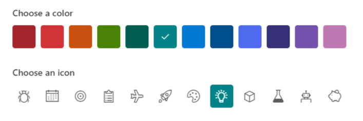
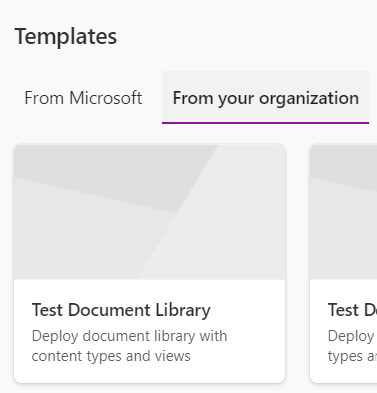
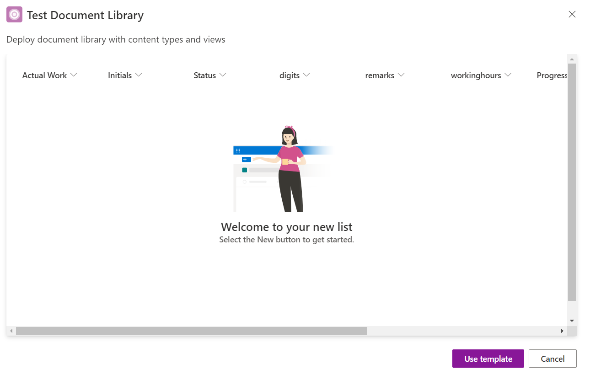

PnP PowerShell has a set of cmdlets to [manage custom list templates.](https://docs.microsoft.com/en-us/sharepoint/lists-custom-template)

[**Add-PnPListDesign**](https://pnp.github.io/powershell/cmdlets/Add-PnPListDesign.html)

[**Get-PnPListDesign**](https://pnp.github.io/powershell/cmdlets/Get-PnPListDesign.html)

[**Remove-PnPListDesign**](https://pnp.github.io/powershell/cmdlets/Remove-PnPSiteDesign.html)

[**Invoke-PnPListDesign**](https://pnp.github.io/powershell/cmdlets/Invoke-PnPListDesign.html)

This article explores how to use PnP PowerShell scripts to manage list templates and create multiple instances of document libraries using a CSV file.

## Add List Template

A list template can be created using an existing configured document library with custom content types, fields and views.

The script below is used to create a list template for the document library using **Get-PnPSiteScriptFromList** and **Add-PnPListDesign.**

```powershell
$adminSiteUrl = "https://contoso-admin.sharepoint.com"
$listUrl = "https://contoso.sharepoint.com/sites/investment/test_ct"

Connect-PnPOnline -url $adminSiteUrl -interactive

$extracted = Get-PnPSiteScriptFromList  -url $listUrl

Add-PnPSiteScript -Title "Test Document Library" -Description "This creates a custom document library" -Content $extracted 
$siteScripts = Get-PnPSiteScript

$siteScriptObj = $siteScripts | Where-Object {$_.Title -eq "Test Document Library"} 

Add-PnPListDesign -Title "Test Document Library" -Description "Deploy document library with content types and views" -SiteScriptIds $siteScriptObj.Id-ListColor Pink -ListIcon BullseyeTarget
```


Note: `ListColor` and `ListIcon` parameters are from the create list experience



The template will be available **From your organization** section from **Create a list.**



## Creating lists/libraries using Invoke-PnPListDesign


**From your organization** under **Templates** section from **Create a list,**  the custom template can be used to create a new library. Once selected the template is loaded and click on **Use Template** to provide a name, description for the library.



Once **Create** is clicked the library is created with the relevant views , content types and fields defined in the template. 

That's great that we can create a document library using the custom list/library template, however there are some settings like versionings , indexed columns, permissions, etc.. which are not included in the list design template yet. 

The cmdlet **Invoke-PnPListDesign** can be used to apply the list design recursively to create multiple instances of the document library updating the internal name and display name based on the csv file and update the settings like indexed columns and versioning.

Sample CSV file format saved as `libraries.csv`

```csv
InternalName,DisplayName
AR,Annual Reports
CR,Credit Risk
Audit,Audit
PO,Purchase Orders
```

Execute the `Invoke-PnPListDesign` cmdlet

```powershell
[CmdletBinding()] 
    Param(
    [Parameter(Mandatory=$false,  Position=0)]
    [String]$adminSiteUrl = "https://contoso-admin.sharepoint.com",
    [Parameter(Mandatory=$false,  Position=1)]
    [String]$siteUrl =  "https://contoso.sharepoint.com/sites/investment",
    [Parameter(Mandatory=$false,  Position=2)]
    [String]$librariesCSV =  "C:\Scripts\DocumentLibraryTemplate\libraries.csv",

    [Parameter(Mandatory=$false,  Position=4)]
    [String]$listDesign = "Test Document Library" 
    )
#creating indexed columns might help with performance of large libraries, i.e. >5000 files
function Create-Index ($list, $targetFieldName)
{
    $targetField = Get-PnPField -List $list -Identity $targetFieldName
    $targetField.Indexed = 1;
    $targetField.Update();
    $list.Context.ExecuteQuery();
}
Connect-PnPOnline -Url $siteUrl -Interactive
Import-Csv $librariesCSV | ForEach-Object {
Invoke-PnPListDesign -Identity $listDesign -WebUrl $siteUrl
#Get library just created and update Internal name and display name
$lib = Get-PnPList -Identity "test_ct" -Includes RootFolder
while(!$lib)
{
    $lib = Get-PnPList -Identity "test_ct" -Includes RootFolder
    sleep -second 5
}
if($lib)
{
    $lib.Rootfolder.MoveTo($($_.InternalName))  
    Invoke-PnPQuery  
    #this will change library title  
    Set-PnPList -Identity $lib.Id -Title $($_.DisplayName)
    #add list to quick launch
    Add-PnPNavigationNode -Title $_.DisplayName -Url $($_.InternalName + "/") -Location "QuickLaunch"
    #enable versioning on the library
    Set-PnPList -Identity $lib.Id -EnableVersioning $True -EnableMinorVersions $True -MajorVersions 500 -MinorVersions 10
    Write-host "`tSetting versioning to major/minor to :"$_.DisplayName
    Create-Index $lib "Created By"
    Create-Index $lib "Modified"
    }
}
```

**OutPut**

```powershell-interactive

```
    PS C:\Windows\system32> C:\Scripts\DocumentLibraryTemplate\ApplyListDesignToCreateLibaries.ps1
    
    Title                                        OutcomeText                            Outcome
    -----                                        -----------                            -------
    Create site column WorkAddress through XML                                          Success
    Create site column _Status through XML                                              Success
    Create site column digits through XML                                               Success
    Create site column remarks through XML                                              Success
    Create site column workinghours through XML                                         Success
    Create site column Progress through XML                                             Success
    Create content type Legal                                                              NoOp
    Add site column WorkAddress to content type                                            NoOp
    Add site column _Status to content type                                                NoOp
    Create content type test_210304                                                        NoOp
    Add site column digits to content type                                                 NoOp
    Add site column remarks to content type                                                NoOp
    Add site column workinghours to content type                                           NoOp
    Add site column Progress to content type                                               NoOp
    Add site column _Status to content type                                                NoOp
    Create content type test_StatusComm                                                    NoOp
    Add site column _Status to content type                                                NoOp
    Create content type test_11                                                            NoOp
    Add site column _Status to content type                                                NoOp
    Create or update library "test_ct"           List with name test_ct already exists.    NoOp
    Add list column "ActualWork"                 List with name test_ct already exists.    NoOp
    Add list column "Initials"                   List with name test_ct already exists.    NoOp
    Add list column "_Status"                    List with name test_ct already exists.    NoOp
    Add list column "digits"                     List with name test_ct already exists.    NoOp
    Add list column "remarks"                    List with name test_ct already exists.    NoOp
    Add list column "workinghours"               List with name test_ct already exists.    NoOp
    Add list column "Progress"                   List with name test_ct already exists.    NoOp
    Add list column "_Comments"                  List with name test_ct already exists.    NoOp
    Add list column "TriggerFlowInfo"            List with name test_ct already exists.    NoOp
    Add list column "SelectFilename"             List with name test_ct already exists.    NoOp
    Add content type "Document"                  List with name test_ct already exists.    NoOp
    Add content type "Folder"                    List with name test_ct already exists.    NoOp
    Add content type "Legal"                     List with name test_ct already exists.    NoOp
    Add content type "test_210304"               List with name test_ct already exists.    NoOp
    Add content type "test_StatusComm"           List with name test_ct already exists.    NoOp
    Add content type "test_11"                   List with name test_ct already exists.    NoOp
    Add view "All Documents"                     List with name test_ct already exists.    NoOp
    Add view "All Documents sorted"              List with name test_ct already exists.    NoOp
    Annual Reports                                                                            
    	Setting versioning to major/minor to : Annual Reports
    

Libraries created after running the script


The custom template for lists/libraries and the ability to invoke the list design programmatically can speed up deploying standardised lists/document libraries.

## Deleting list templates using Remove-PnPListDesign


The list template can be deleted by removing the list design followed by the site script. The script below removes a list design with the associated site script.

```powershell
$adminSiteUrl = "https://contoso-admin.sharepoint.com/"
$listDesignName = "Test Document Library"
Connect-PnPOnline -url $adminSiteUrl -Interactive

$listDesign = Get-PnPListDesign -Identity $listDesignName
$siteScriptId = $listDesign | select SiteScriptIds
$siteScript = Get-PnPSiteScript -Identity $siteScriptId.SiteScriptIds.Guid
Remove-PnPListDesign -Identity $listDesignName -Force

Remove-PnPSiteScript -Identity $siteScript -Force
```
