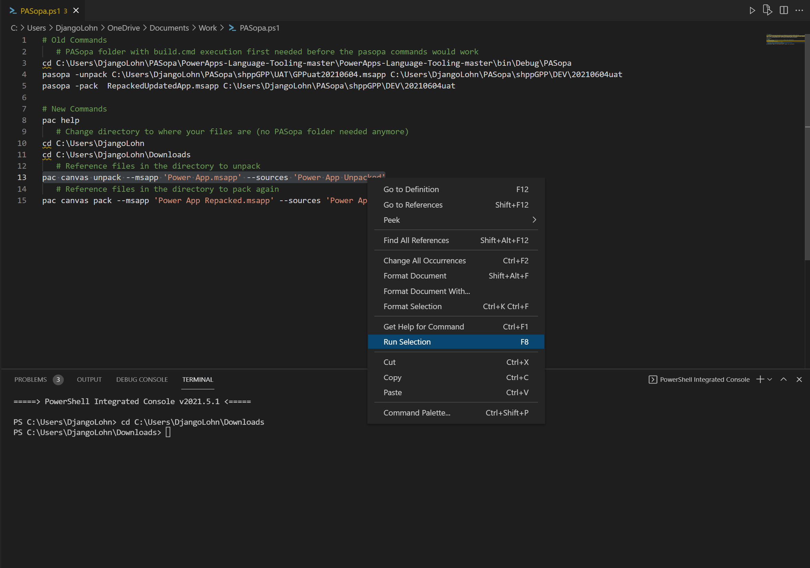

## Why?

In April, I showed how to unpack and repack Power Apps .msapp files of
Canvas Apps in the blog post [Power Apps Source Code file editing for
Canvas Apps
(microsoft.com)](https://techcommunity.microsoft.com/t5/microsoft-365-pnp-blog/power-apps-source-code-editing-for-canvas-apps/ba-p/2256476) Using
this functionality, we can view and edit the source code of Canvas Apps.
In a recent announcement ([Canvas source code tool integrated with Power
Platform CLI | Microsoft Power
Apps](https://powerapps.microsoft.com/blog/canvas-source-code-tool-integrated-with-power-platform-cli/)),
Microsoft announced that the same functionalities are now available
within the Power Platform VS Code Extension of Visual Studio Code!

This means that after installing this extension, we can do the same
unpacking and packing without leaving Visual Studio Code.

## What?

This posts will show how easy it is to use Visual Studio Code so we can
unpack and (re)pack .msapp files of Canvas Apps:

## How?

1\) First install the Power Platform VS Code Extension in your Visual
Studio Code Client using the Visual Studio Marketplace ([Power Platform
VS Code Extension - Visual Studio
Marketplace](https://marketplace.visualstudio.com/items?itemName=microsoft-IsvExpTools.powerplatform-vscode)).

2\) After installing the extension a computer restart may be required.
We can from this moment on, run commands from within Visual Studio using
the built-in Terminal.
In my example I saved the text file with commands as a Power Shell file
(.ps1). In this type of files, short cuts like F8 can be used to run
selected commands:

Notice the improved commands where referencing (input and output) files
is much easier now!

In the Marketplace screenshot above, you can see that the extension is
in Preview at the moment.
Please be aware of this and read the announcement link above on how to
report issues.
Originally published at [Power Apps: source code edit for Canvas Apps in
Visual Studio Code »
Knowhere365](https://knowhere365.space/power-apps-source-code-edit-for-canvas-apps-in-visual-studio-code/)
