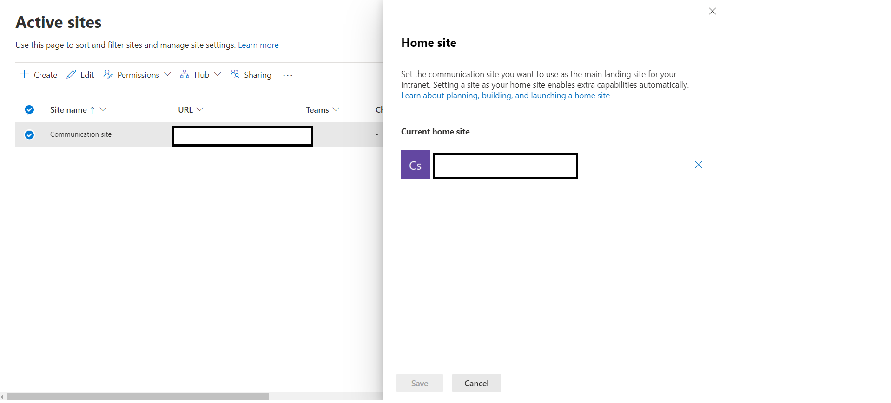
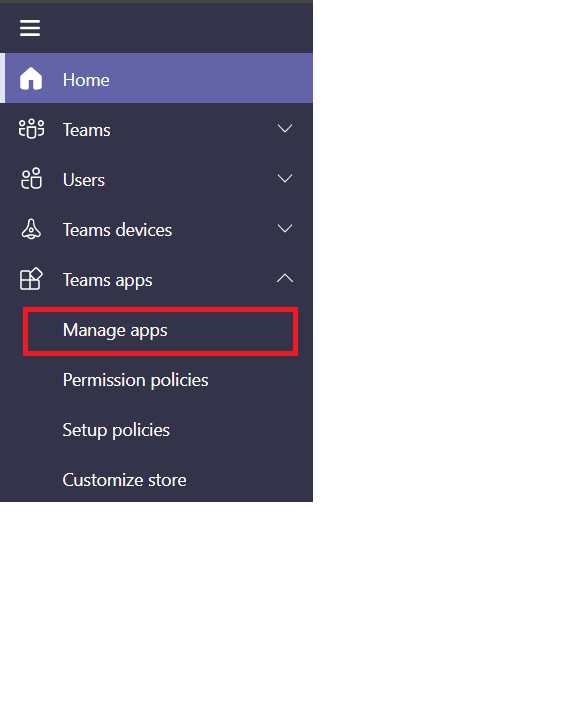
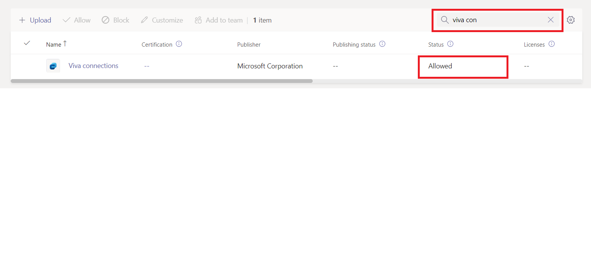
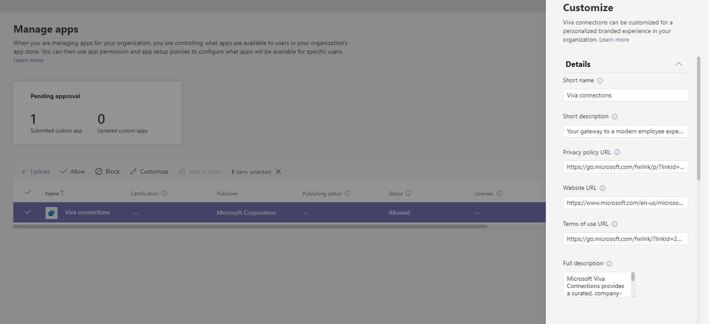
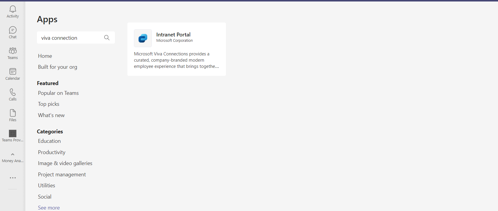
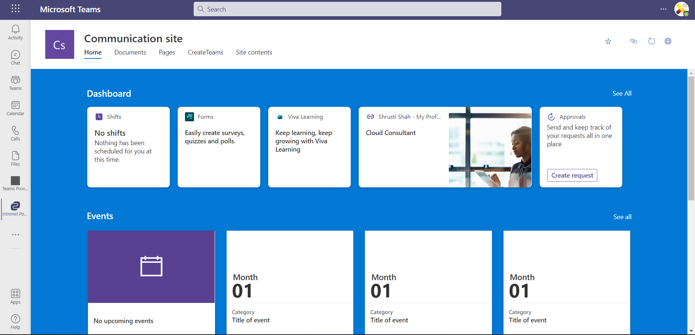

As we all know, Viva connection is a part of Employee Experience
Platform.

In this article you can expect to quickly add your home site portal as
Viva connection app right into your Microsoft Teams

Before we move ahead, a quick note,

1.  If you don't have an existing home site in your tenant you can
    Create a SharePoint Home Site by navigating to SharePoint Admin
    Centre \> Active sites \> Select any site you want to convert it to
    Home Site, you will see an option in the command bar like Change
    Home Site as shown in Fig 1.1

Fig 1.1 -- Change Home Site Setting

1.  Select  the Change Home site, a panel will open where you will be
    asked to add your communication site URL which you want to convert
    to Home Site as shown in Fig 1.2
    

Fig1.2 -- Convert site to Home Site Panel

1.  In few seconds your communication site will be converted to home
    site
2.  Make sure you have global left navigation enabled in your
    communication site
Let's move ahead, if you have the home site with global left navigation
now, we are ready to use this in Viva connections
Step 1: Go to Teams Admin center
Step 2: Navigate to Teams Apps \> Manage Apps as shown in Fig 1.3

Fig 1.3 -- Manage Apps
Step 3: By default, Microsoft has blocked the Viva connections app. So,
in the manage apps, you will find a search box, search for viva
connections, you will find **Viva Connections app**, with **status as
Blocked**
Select the app, select  Allow from the top command bar, the status will
be changed to Allowed as shown in Fig 1.4

Fig 1.4 -- Viva connection
app changes status to Allowed as by default it is set to Blocked
Step 5: You can also customize your app by selecting the app and
clicking on customize option from the top command bar as shown in Fig
1.5

Fig 1.5 --
Customize Viva Connection app from Teams admin centre
Step 6: Now let's navigate to Microsoft Teams
Step 7: In add an app, search by App name (Viva connections),from the
Fig 1.6, I changed the app name to Intranet portal, hence in the Fig 1.6
you will find the different App name

Fig 1.6 -- Viva connections app in Microsoft Teams
Step 8: Voila, now, after creating a Home site into your SharePoint
portal. As shown in Fig 1.7, Your home site is up and running in your
Viva Connections app and right from Microsoft Teams app, you can edit
and make changes to your Home site.

 Fig 1.7 --
Viva connections app with your SharePoint home site.

I hope you all got a brief understanding on how you can quickly set up
Viva connections app into your Microsoft Teams from Microsoft Teams
Admin center.
