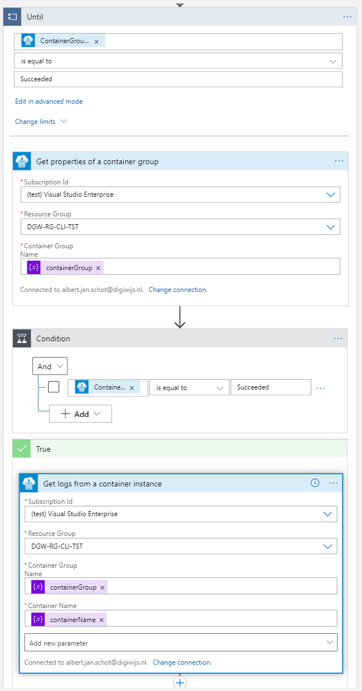

Using the CLI for Microsoft 365, you can manage your Microsoft 365
tenant and SharePoint Framework projects on any platform, including
running it in a container. By running the CLI for Microsoft 365 in a
container you free yourself from installing it locally. Leveraging a
Logic App, Azure Container Instances and the CLI for Microsoft 365 you
can automate reporting and maintenance of your tenant.
The goal is thus to generate some form of reporting on our tenant. There
are a lot of [sample scripts
available](https://pnp.github.io/cli-microsoft365/sample-scripts/ "CLI for Microsoft 365 sample scripts"),
but we will start simple by reporting all deleted Office 365 Groups
(this will include deleted Teams). Executing a report like that with the
CLI for Microsoft 365 would be just a single line:  
 

```bash
m365 aad o365group recyclebinitem list
```
 

To achieve our reporting scenario we need the a few other components as
well:

1.  An Azure resource group to group our resources together 
2.  A managed identity to make sure we can access our tenant securely;
3.  A Logic App to orchestrate everything;
4.  Azure Container Instances to execute our script;
5.  A Git repo that contains the script we want to execute and pull in;

If you are new to running Azure Containers and using Logic Apps there is
a great [walkthrough on running sentiment analysis with Azure Container
Instances](https://docs.microsoft.com/en-gb/samples/azure-samples/aci-logicapps-integration/aci-logicapps-integration/ "running sentiment analysis with Azure Container Instances ").
But let us get started with the first step.

Create an Azure Resource Group

To create a new Azure resource group simply log in to the Azure Portal
and create a new resource group using the **create a resource** button.
For demo purposes I called my resource group *cli-test*.

Create a Managed Identity

In our resource group we can create a new user managed identity that we
can use. Select  the **add** button and search for **User Assigned
Managed Identity** to create the new managed identity. Simply provide a
name and create your new managed identity. 

 
Once the managed identity is created it still need permissions to do
anything. Just creating it is not enough. In order to use the managed
identity we need to make sure that it has the correct permissions. The
[CLI for Microsoft 365
docs](https://pnp.github.io/cli-microsoft365/user-guide/using-own-identity/#configure-api-permissions)
explain in details what the steps are required. For our reporting
scenario's we need support to query the Graph and SharePoint. You can
use the CLI for Microsoft 365 to easily hand out the permissions you
need with the following snippet: 
 

```bash
m365 aad approleassignment add --displayName "ma-cli-test" --resource "Microsoft Graph" --scope "Sites.Read.All"
m365 aad approleassignment add --displayName "ma-cli-test" --resource "Office 365 SharePoint Online" --scope "Sites.Manage.All"
m365 aad approleassignment add --displayName "ma-cli-test" --resource "Microsoft Graph" --scope "Group.Read.All" 
```
 

Now all we need is the GUID that identifies the managed identity.
Navigate to <https://portal.azure.com> select **Azure Active Directory**
and pick **Enterprise Applications**. In the Application Filter filter
on **Managed Identities** and make sure to pick the **Application Id**
of your newly created managed identity. 


Store it somewhere save as we need it at a later moment. 

Create a Logic App

As we need a Logic App to orchestrate the execution of our script the
first step is to create one. You can do so in any resouce group, or
create a new one. There are no requirements for your Logic App. So we
pick a **Logic App (Consumption)** and provide a resource group and
name. Once the Logic App is created navigate to it and select the
**edit** button. Once in edit mode you are free to pick your trigger.
You can pick any trigger you like, for demo purposes you could connect
it to a list in SharePoint Online, or just use a HTTP trigger. The next
step is to create two parameters, **containerGroup** and
**containerName**. Both will be used more than once so it helps to
create them parameters, but it is not required. For demo purposes I
added a small snippet as a postfix to identify when it was created: 

``` {.lia-code-sample .language-excel}
formatDateTime(utcNow(),'MM-dd-yyyy')
```

 This helps when debugging as you can always identify when something was
created. The next step is to add a new action of type **Create or update
a container group**. It is a pretty complex action with a lot of
parameters to get right, so it is worth to pay close attention when
typing:

||||
|--- |--------------- |--------------------------- |
|Option|Value|Comments|
|Subscription id|Any subscription you like|I suggest putting it all in the same subscription.|
|Resource Group|Any resource group you like|I suggest putting it all in the same resource group.|
|Container Group Name|@{variables('containerGroup')}|Parameter for ease of use|
|Container Group Location|Any location is supported||
|Container Name - 1|@{variables('containerName')}|Parameter for ease of use|
|Container Image - 1|m365pnp/cli-microsoft365:latest||
|Container Resource Requests CPU - 1|1|If you are planning to run complex or large scripts it might be worth to add additional resources.|
|Container Resource Requests Memory - 1|1.5|If you are planning to run complex or large scripts it might be worth to add additional resources.|
|Container Command Segment - 1|bash|You cannot execute multiple commands in a single line. You will need to add each statement to a segment.|
|Container Command Segment - 2|/mnt/repo1/test.sh|The value of the mount path and script name are dependant on settings below.|
|Container Volume Mount Path - 1|/mnt/repo1||
|Container Volume Mount Name - 1|gitrepo|The name for the mount path must match the volume name specified later.|
|Volume Git Repo Volume Repository - 1|`https://github.com/appieschot/cli-test.git`|Any public repository will do.|
|Volume Name - 1|gitrepo||
|ContainerGroup Managed Identity User Assigned Identities|{"/subscriptions/[guid]/resourcegroups/[rg-name]/providers/microsoft.managedidentity/userassignedidentities/[identity-name]": {}}|Make sure to update the bold parts.|
|ContainerGroup Restart Policy|OnFailure|Make sure the container is restarted if there are problems.|


This action will thus create a new container instance, pulls in the CLI
for Microsoft 365 image and make sures that a git repo with a script is
pulled in. And best of all; the container created will be running with
the managed identity you have specified. Now all we need to do is to
capture the output of our container instance and clean up. 
To do so add a action of type **until**. Do not configure any
requirements yet and simply add an action of type **Get properties of a
container** to retrieve the latest status, use the
**containerGroup** parameter to make sure you get the correct container.
Put in the Container Group name as a parameter and check for status
**Succeeded** of the untill action. Add a new condition and check there
for the same status. In the true statement we can implement the logic
for retrieving our data. You can use the **Get logs from a container
instance** and e-mail the output to yourself. 



In the false branche add an wait **action** that waits for 10 or 15
seconds. That will make sure it takes a while before it retries checking
the status to see if it is finished.  

Create your script

The last part is to make sure that the test.sh file referred to as being
mounted in your container actually exists. It should contain all logic
to run your script, but the first step is to authenticate. In order to
authenticate with the managed identity we need to tell the CLI for
Microsoft 365 to do so. By specifying the login using the authType
parameter we can pass the GUID of our managed identity. The CLI then
knows to use the managed identity of the container it is running in and
you are done. 
 

``` {.lia-code-sample .language-applescript}
m365 login --authType identity --userName 00000000-0000-0000-0000-000000000000 
m365 aad o365group recyclebinitem list --output json
```
 

Full Logic App

Once all these components are in place you can simply run any script in
the container. Just make sure you have the appropriate permissions
assigned to the Manged Identity! 

PnP Recording

If you are looking at a video walkthrough you can checkout the PnP
recording. It highlights the results and steps taken to achieve basic
reporting on your tenant. 
