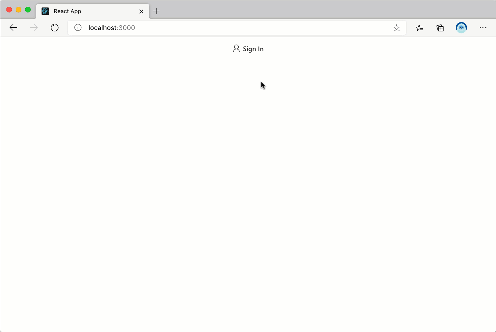
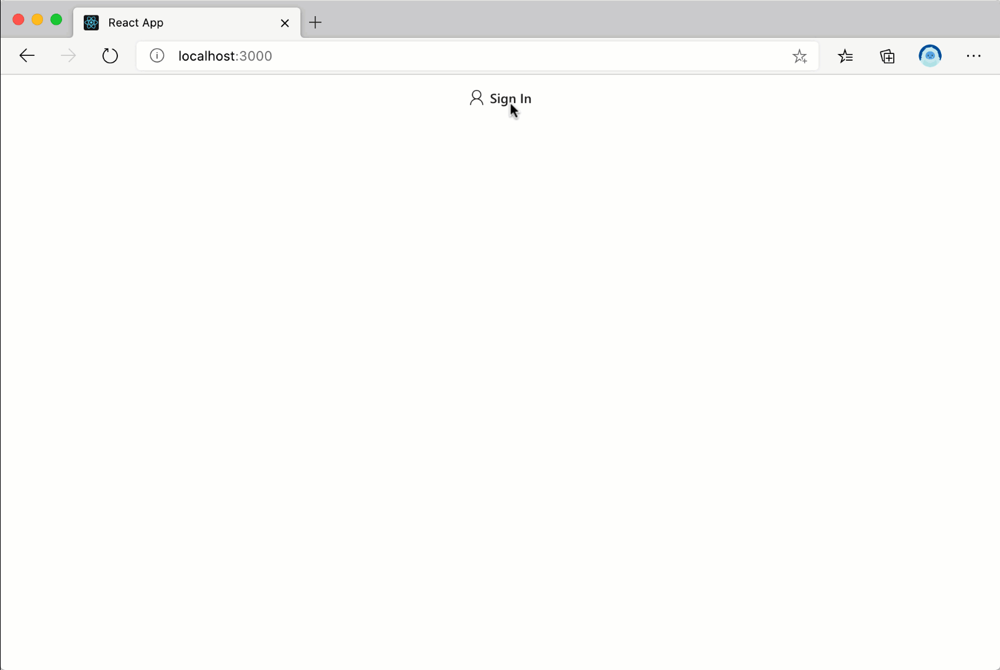

When using Microsoft Graph Toolkit with Azure AD single-tenant Azure AD
apps, you need to adjust MSAL Provider initiation for your app to work.
Here is how.

## Microsoft Graph Toolkit - the easiest way to connect to Microsoft 365 

[Microsoft Graph
Toolkit](https://docs.microsoft.com/graph/toolkit/overview?WT.mc_id=m365-12257-wmastyka)
(MGT) is a set of web components that abstract away the plumbing behind
connecting to Microsoft Graph and allow you to focus on your application
instead.
Microsoft Graph Toolkit is available as a generic set of web components
distributed through the
**@microsoft/mgt** npm
package. If you're [building apps with
React](https://docs.microsoft.com/graph/toolkit/get-started/use-toolkit-with-react?WT.mc_id=m365-12257-wmastyka),
you can use the
**@microsoft/mgt-react**
package which wraps MGT web component in React components making it
easier to pass complex data and hook the components up to events.

## Before you begin, connect to Azure AD 

Microsoft Graph Toolkit allows you to connect your app to Microsoft 365
through [Microsoft
Graph](https://developer.microsoft.com/graph/?WT.mc_id=m365-12257-wmastyka).
To do that, it needs to authenticate the user working with your web app
against their tenant.

If you build applications using [SharePoint
Framework](https://docs.microsoft.com/sharepoint/dev/spfx/sharepoint-framework-overview?WT.mc_id=m365-12257-wmastyka),
you can reuse the existing authentication context. But if you build a
standalone web app, you need to register an application in Azure Active
Directory and use it with MGT's [MSAL
Provider](https://docs.microsoft.com/graph/toolkit/providers/msal?WT.mc_id=m365-12257-wmastyka),
like:

``` highlight
import { MsalProvider } from '@microsoft/mgt-msal-provider';

Providers.globalProvider = new MsalProvider({
  clientId: 'ab9533b2-4e1e-4aaf-8412-8f02cfb9484c'
});
```


In some cases though, this setup is not enough.

## Single- vs. multi-tenant Azure AD apps 

When you create an Azure AD app, you choose whether you want the
application to be single- or multi-tenant. In other words, whether users
from any directory should be allowed to use the app or only users from
the same directory where the app is registered.
If your organization uses a single directory, registering your Azure AD
app as single-tenant allows you to create an additional security measure
preventing your app from unintended use.

The side-effect is though, that if you want to use a single-tenant Azure
AD app with Microsoft Graph Toolkit, you need to instruct it where your
Azure AD app is registered.

## Use single-tenant Azure AD apps with Microsoft Graph Toolkit 

If you try to use a single-tenant Azure AD with Microsoft Graph Toolkit
using the default MSAL Provider setup with just the `clientId`, when you
try to login to your app, you won't be able to.


While you won't see any error in the UI, if you open developer tools in
your browser and take a look at requests, you will see a GET request to
`https://login.microsoftonline.com/common/reprocess` followed by a 302
response with the error message in the query string:

```bash
http://localhost:3000/#error=invalid_request&error_description=AADSTS50194%3a+Application+%27ab9533b2-4e1e-4aaf-8412-8f02cfb9484c%27(My+M365+app)+is+not+configured+as+a+multi-tenant+application.+Usage+of+the+%2fcommon+endpoint+is+not+supported+for+such+applications+created+after+%2710%2f15%2f2018%27.+Use+a+tenant-specific+endpoint+or+configure+the+application+to+be+multi-tenant.%0d%0aTrace+ID%3a+79cfbca0-d484-461e-9d56-f3a4b4a30f00%0d%0aCorrelation+ID%3a+ffbed0df-da84-4076-a52b-9d3037c28ff9%0d%0aTimestamp%3a+2021-01-04+12%3a10%3a38Z&state=eyJpZCI6ImQyNGZjY2YxLTk2OTk...
```

For readability, here is the exact error message:

> AADSTS50194: Application 'ab9533b2-4e1e-4aaf-8412-8f02cfb9484c'(My
> M365 app) is not configured as a multi-tenant application. Usage of
> the /common endpoint is not supported for such applications created
> after '10/15/2018'. Use a tenant-specific endpoint or configure the
> application to be multi-tenant

For you to be able to use a single-tenant Azure AD app with Microsoft
Graph Toolkit, you need to extend the MsalProvider initialization with
`authority`:

``` highlight
import { MsalProvider } from '@microsoft/mgt-msal-provider';

Providers.globalProvider = new MsalProvider({
  clientId: 'ab9533b2-4e1e-4aaf-8412-8f02cfb9484c',
  authority: 'https://login.microsoftonline.com/f7322380-f203-42ff-93e8-66e266f6d2e4'
});
```

The GUID in the `authority` (`f7322380-f203-42ff-93e8-66e266f6d2e4`), is
the ID of the Azure Active Directory where you have registered your
application.

After this change, you will be able to use your app with Microsoft Graph
Toolkit just as you'd expect.



When you use multi-tenant Azure AD apps with Microsoft Graph Toolkit,
instantiating the MSAL Provider with just the `clientId` is sufficient.
But when you use a single-tenant Azure AD app, you also need to specify
the `authority` to instruct Azure AD where the app is registered.
