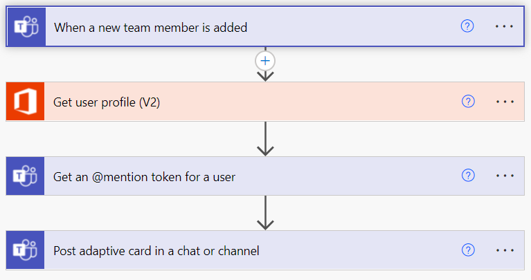
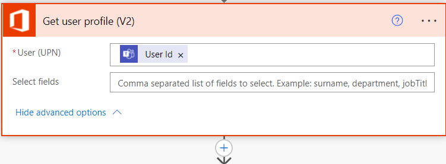
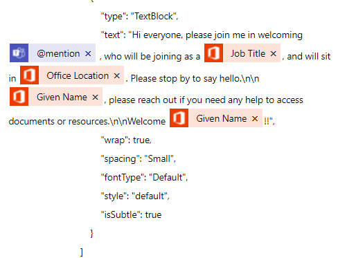
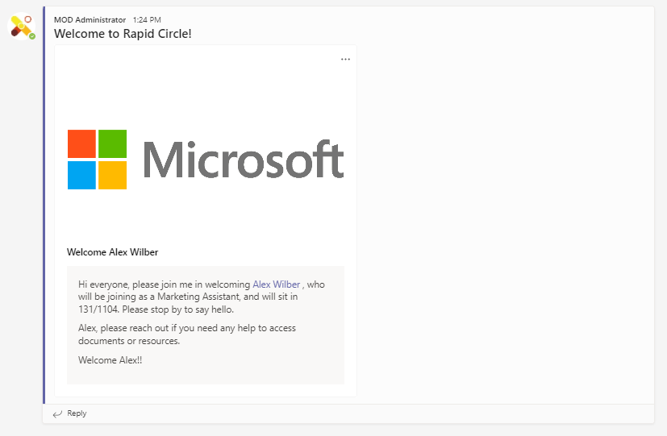

Let’s make this process simple by using power automate automated flow wherein whenever a new employee is added in Organization’s Team -> General Channel -> Warm welcoming adaptive card will be posted in the channel where the new employee will also be mentioned.

Sounds interesting, isn’t it?

Let’s dig into more details

In this article you will see few easy steps as shown in Fig 1.1, in which whenever a new employee is added this flow will be triggered, will get new employee details then post an adaptive card in the Teams General channel @mentioning new employee in the post.

Let’s look at the high-level Automation flow from Fig 1.1, then will look at trigger and actions in details



Fig 1.1 - High level automated flow steps

Let’s take a closer look at trigger and actions in the flow

**Step 1** \- This is the trigger on which this flow will be automated, so from the Teams section, choose When a new Team member is added trigger.

In Fig 1.2 - Give your organization Team Name


Fig 1.2 - When a new team member is added selected as trigger

**Step 2** \- Add an action and select get user profile (v2) from the list of options, this will bring all the details about the new employee which will use in adaptive card

In Fig 1.3 - Pass the user Id from the first step using the dynamic content, you can also pass some selected fields of the user like surname, department, etc keep it blank to get all the details in Select fields



In Fig 1.3 - Get user profile (v2)

**Step 3** \- Now we have the user details, let’s get the new employees @mention token so that we can use it in adaptive card. So, from all the connectors select Get an @mention token for a user.

In Fig 1.4 - You just need to pass the user Id from Step 1 using dynamic content


Fig 1.4 - This will get the @mention token of the new employee

**Step 4** \- This is the final and important step of the flow, From the list of actions select, “Post an adaptive card in chat or channel”.

In Fig 1.5 -

*   In **Post as** Select from the list of dropdown options like User, Flow bot or Power Virtual Agent. This field is to know who has posted this adaptive card
*   **Post in** \- Select where you want to post, for new employees it is preferred to post in the Organization Team -> General Channel, so select channel
*   **Team** \- Select the Team’s name
*   **Channel** \- Select the Channel name
*   **Adaptive card** \- Post the JSON of your adaptive card. I have added the sample below. Refer that or create a design as per your choice in adaptive [https://adaptivecards.io/designer/](https://adaptivecards.io/designer/)
*   **Welcome Message** \- You can also give a welcome message headline for your adaptive card


Fig 1.5 - Post an adaptive card in chat or channel

Sample Adaptive card JSON:

```JSON
{
    "type": "AdaptiveCard",
    "$schema": "http://adaptivecards.io/schemas/adaptive-card.json",
    "version": "1.5",
    "body": [
        {
            "type": "Image",
            "url": "{Give the location URL of your Image file}"
        },
        {
            "type": "TextBlock",
            "wrap": true,
            "text": "Welcome @{body('Get_user_profile_(V2)')?['displayName']}",
            "fontType": "Default",
            "weight": "Bolder",
            "color": "Dark",
            "isSubtle": false,
            "style": "heading"
        },
        {
            "type": "Container",
            "items": [
                {
                    "type": "ColumnSet",
                    "columns": [
                        {
                            "type": "Column",
                            "width": "stretch",
                            "spacing": "Medium",
                            "items": [
                                {
                                    "type": "TextBlock",
                                    "text": "Hi everyone, please join me in welcoming @{body('Get_an_@mention_token_for_a_user')?['atMention']} , who will be joining as a @{body('Get_user_profile_(V2)')?['jobTitle']}, and will sit in @{body('Get_user_profile_(V2)')?['officeLocation']}. Please stop by to say hello.\n\n@{body('Get_user_profile_(V2)')?['givenName']}, please reach out if you need any help to access documents or resources.\n\nWelcome @{body('Get_user_profile_(V2)')?['givenName']}!!",
                                    "wrap": true,
                                    "spacing": "Small",
                                    "fontType": "Default",
                                    "style": "default",
                                    "isSubtle": true
                                }
                            ]
                        }
                    ]
                }
            ],
            "style": "emphasis"
        }
    ]
}
```

In Fig 1.6 - This is a part of JSON code, here you can see we have used the dynamic content from the Get user profile connector and @mention token is used in the text message. This part of code is already added in the sample JSON use that or select dynamically.



Fig 1.6 - Adaptive card message with the user profile details fetched dynamically and @mentioned user in the card.

Now it’s the time to reveal the flow outcome. When a new employee will be added to the Team, an adaptive card will be posted with all the user details in Teams General Channel as shown in the Figure below



I hope this article will help many organizations where they are looking out for a solution of welcoming newly onboarded employee, they can use this automated flow to welcome new employee in Teams by posting an adaptive card.

Stay tuned for my upcoming blogs.

Keep Reading, Keep Sharing!
