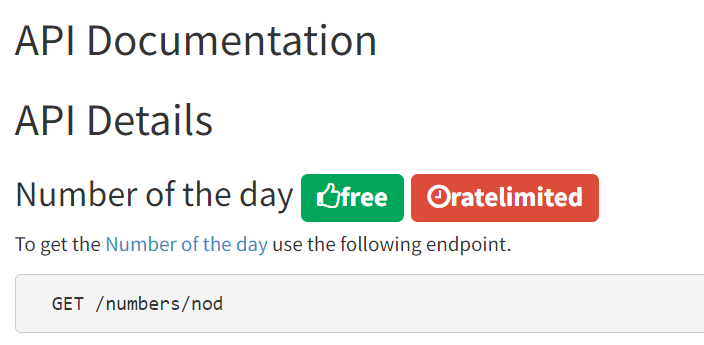
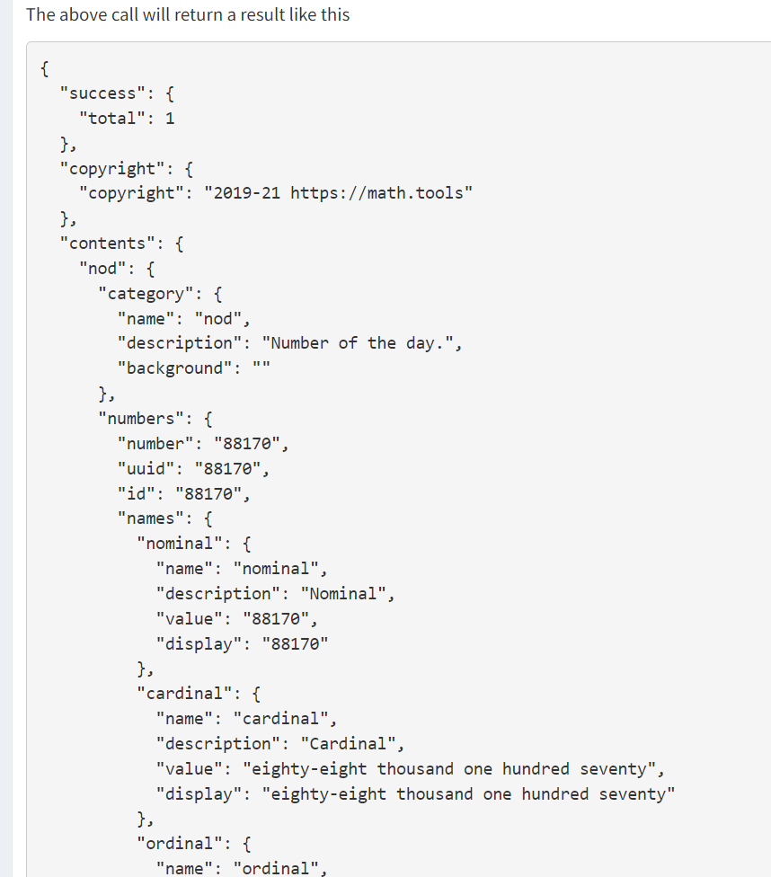
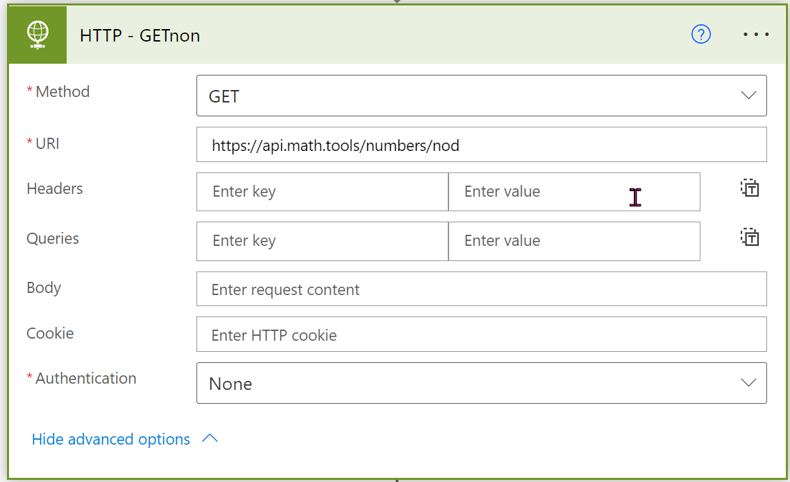
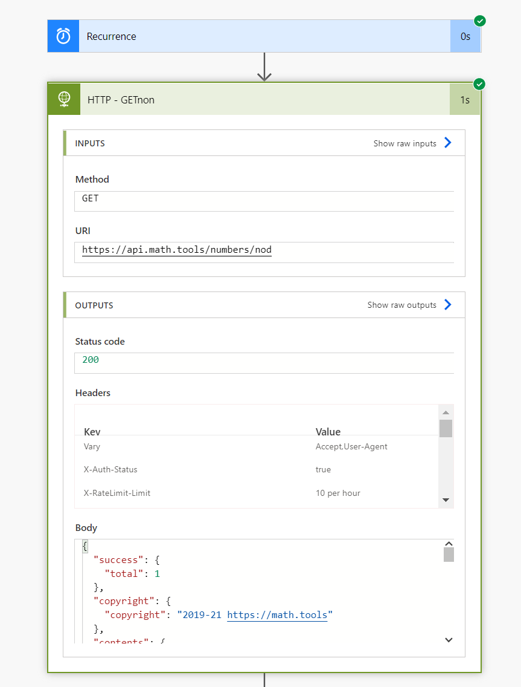
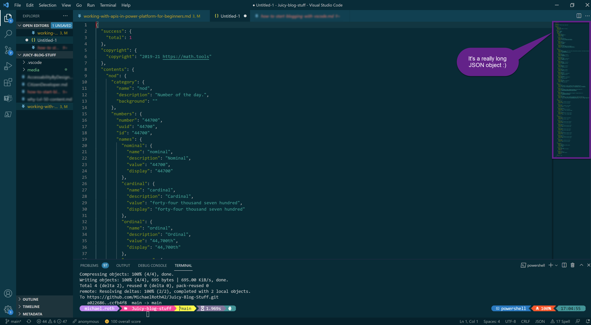
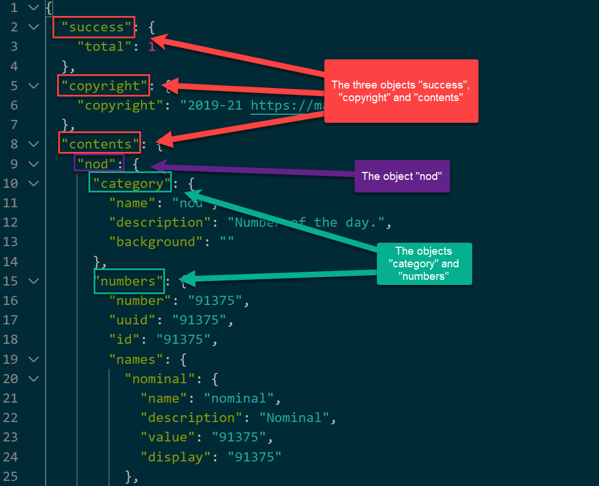
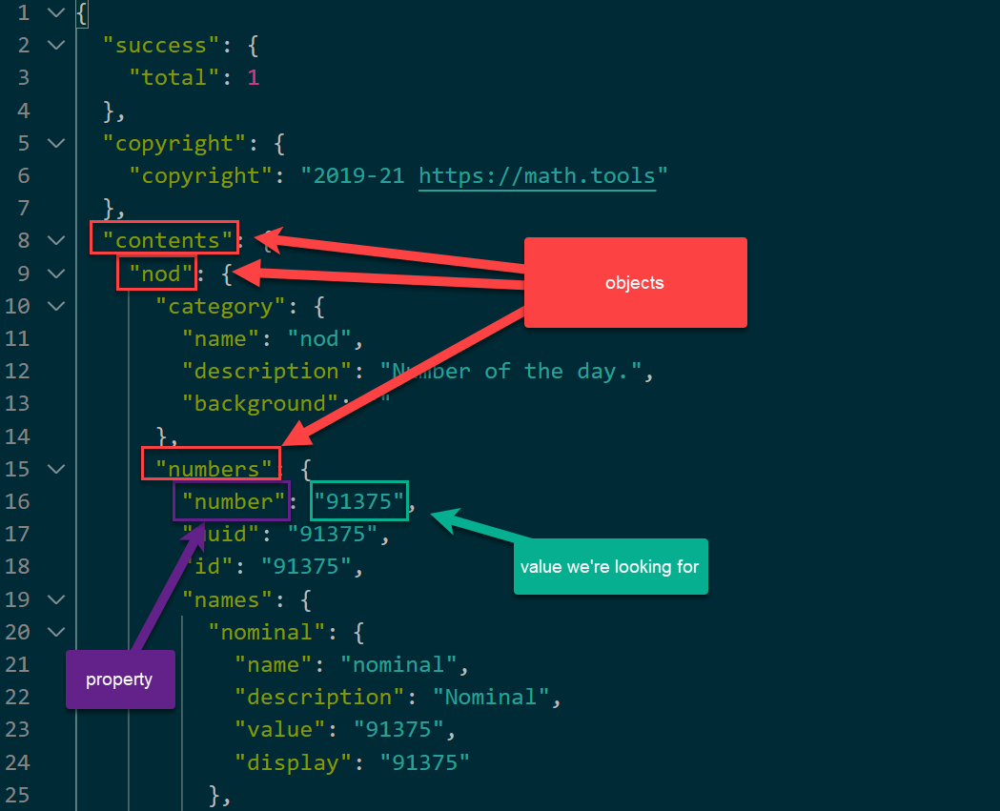
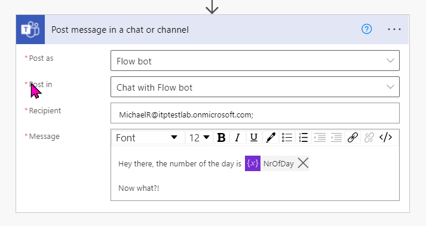

I recently learned how to work with APIs and the different methods to
call them. I started with a straight forward example that's not too
complex. I used an open API (that means I don't need authentication for
my request) to get the [number of the
day ](https://math.tools/numbers/number-of-the-day/)from a website
called [MathTOOLS](https://math.tools/). I want this number of the day
to be posted as a chat message in Microsoft Teams.

Let's start with some theory first

## What's an API?

API is an acronym for **Application Programming Interface** and they
allow applications to communicate with each other and exchange data. An
API lists operations that it can perform and which you can use, if you
know how to trigger them. Usually the operations are\...

- **GET**(read)
- **POST**(write)
- **PUT**(update)
- **PATCH**(update, but only partially)
- **DELETE**(remove)

## How to address APIs?

An API is an interface that you can call and communicate with. You can
perform different operations, like getting data, writing things, and so
on. But you need to know the correct language, that the API will
understand, you need to know the correct direct dial and You need to
know what to tell the API to make it do what you want it to do. The
language you need is **HTTP**, which is an acronym for **Hypertext
Transfer Protocol**.

If the browser on your computer wants to communicate with a server
somewhere on the world, it sends an **HTTP request** (it asks politely)
and when we did everything in the right way, we will get a polite
answer, an **HTTP response**.

An **HTTP request** gives us the ability to communicate with an **API**.
So much for the theory, now let's get our hands dirty :clapping_hands:
and let's see how it looks in Power Automate.

## HTTP request

As I mentioned earlier an **HTTP request** consists of a view things. We
will need a\...

- Method
- URL
- Headers
- and a body

### Method

Luckily we know the methods already.

  ------------ ------------------
  **Method**   **Action**
  GET          read
  PUT          update
  POST         write
  PATCH        update partially
  DELETE       remove
  ------------ ------------------

In this use case we want to **get** the number of the day, so we choose
the **GET** method.

### URL

Now for the URL we need to know the **URL** (kind of obvious, isn't it of the service we want to address. But
not only that, we will also need the **endpoint**. This is something
like the direct call, putting you to that exact point that you want.
Usually an API will tell you how the endpoint looks:

The endpoint of the website MathTOOLS is \`<https://api.math.tools>\`,
but if we read carefully (I usually struggle with that), we get more details for the API of the number
of the day:

The endpoint for the number of the day is
\`<https://api.math.tools/numbers/nod>\`. The API documentation even
provides us with the information of how the HTTP response will look
like:

It's a very long JSON object (if you want to get started with JSON, I
recommend the amazing blog from Bob German [Introduction to
JSON.](https://bob1german.com/2021/01/11/introduction-to-json/)

But let's stay at our HTTP request in Power Automate. We know the
Method, we know the URL and we know that we don't need any
authentication. That means we can fill out all mandatory fields in that
flow action and it looks like this:

Let's run this flow on a daily basis and see what the result looks
like:

(Since you can hardly see the result, I paste the body here once again)

And that's it, we used an **HTTP request** to **GET** information from
a **API**. Now for the last part of this blog, we want to use some
information from this result to be posted in a chat in Teams.

Use a certain information from a JSON object in a chat message

Now it would make a lot of sense, if we cover the question, how to use a
certain information from that JSON object in, let's say a chat message,
right?

Let's say, we want to post the number of the day in a daily Microsoft
Teams chat. We need just two steps for that:

1. put the information of that JSON file in a variable, so it's always
up to date

2. use that variable in message in a Microsoft Teams chat

To use a certain information in a variable, you first need to initialize
a variable and fill out all the information:

**Name**: I called mine NrOfDay

**Type**: We want to use a **string** here (a string is a sequence of
characters, that can include letters or numbers, but it will be
recognized as a "text")

**Value**: Here we want to define the value of this variable. In our
case that means that particular information from this long JSON object.

We want the value of the property "number"

Notice, that this JSON element consists of three different objects. We
have the objects "success", "copyright" and "content". The object
"content" contains an object called "nod", which contains two more
objects called "category" and "numbers".

As stated earlier, we want the value of the property "number", which
is located in the object "numbers" (which is part of the object
"nod", which is part of the object "content").

Now we can tell our variable in Power Automate the exact location of the
value we want to use in this variable. The expression to "navigate" to
the value of this property looks like this:

\`body('HTTP\_-\_GETnon')\['contents'\]\['nod'\]\['numbers'\]\['number'\]\`

The first part (\`body('HTTP\_-\_GETnon')\`) tells where we want to
look, the later parts are navigating through the JSON object until we
reach the exact object and the exact property. With this method you can
get any value of any JSON object you like.

Now you can build in the variable in a "Post message in a chat or
channel" action as dynamic content in Flow and it will always show the
value of the property of that JSON object.

That's it. That is how you call an API, get a JSON object back and use
certain values from that object in Power Automate. I hope you liked it
and it helps you. If anything is unclear, or you have questions, please
feel free to reach out to me. Easiest way would be
[twitter](https://twitter.com/MichaelRoth42).

As I mentioned in the beginning, I will further work with APIs. If you
want to learn more, here's what I'm going to work on next. If you have
specific questions, please ask me or make suggestions. I'm always eager
to learn new things.

Next API topic: What's a custom connector, where is the difference
between a http request and a custom connector and when to use what.
